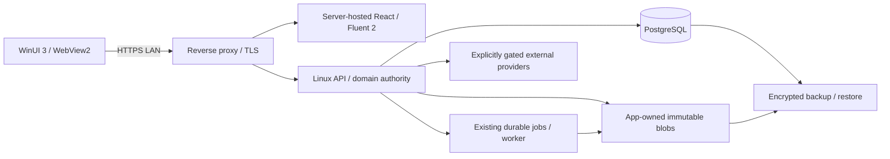

# ADR 0050 — Linux Server + Windows Native Client v1

**Status:** ACCEPTED PRODUCT OWNER ARCHITECTURE DECISION — Issue #89; repository certification pending
**Date:** 2026-10-03
**Task:** `VALORA-TASK-ARCH-WINDOWS-CLIENT-SERVER-001`
**Authority:** [Issue #89](https://github.com/Reguluspt/valora-engineering/issues/89), deployment/client v1 scope only.

## Context and scope

The Product Owner accepts a Linux single-node Server, HTTPS over LAN, WinUI 3 native Windows shell, WebView2, server-hosted React / Microsoft Fluent 2 light, a small typed native bridge and MSIX. PostgreSQL remains authoritative; app-owned immutable blobs and encrypted backup remain the storage/recovery direction. Server v1 has no local LLM or GPU dependency.

This records the accepted decision; it does not certify runtime, authorize a deployment or open a later product stage. The external architecture proposal is reference only. Current CODEX, guardrails, Unified Roadmap and accepted domain ADRs remain cumulative. ADR 0050 supersedes Windows/Docker Desktop local-stack production direction and architecture selection after Windows Preview only; unrelated domain authority is unchanged.

## Decision

### D1. Responsibility split

| Owner | Responsibility |
|---|---|
| Linux backend/domain | Authentication/session, tenant/organization authority, RBAC, domain commands, business validation, Case State / Next Action, audit, CAS/version enforcement, PostgreSQL, immutable document authority, worker/jobs, provider integrations and authoritative APIs |
| Windows native client | Native window lifecycle, WebView2 hosting, trusted-origin navigation, file picker, Save As, drag/drop mediation, Word/Excel launch, OS notifications, deep links, secure local configuration, network/reconnect UX and MSIX install/update surface |
| React / Fluent 2 light | Navigation, forms/tables, Workbench, Case State presentation, business-facing UI and UI not requiring an OS-native capability |

```text
Native shell != business authority
Web frontend != business authority
Linux backend/domain = business authority
```

C# must not implement domain mutation or duplicate business validation as authority. Client-side affordances never replace server tenant/RBAC/state/version checks. Native notifications, navigation, downloaded files and local preferences are not domain facts.

### D2. Deployment and early defaults

- Single-node Linux LTS family; Ubuntu Server LTS preferred, exact release pinned in a later task.
- Docker Engine + Compose on the server; Kubernetes and HA are not v1 requirements.
- Windows 11 x64 first, WinUI 3 + WebView2 Evergreen Runtime.
- Admin-configured HTTPS server URL; no automatic LAN discovery v1 and no hard-coded host/IP.
- Server-hosted React/Fluent 2 light in WebView2; do not bundle React in MSIX by default or rewrite it into WinUI controls.
- Windows package contains no backend, database, worker or authoritative blob store. Docker Desktop local stack is not production architecture; existing developer Compose usage is development evidence.
- Reverse proxy is the HTTPS ingress. Database, Redis and storage service/admin ports stay private; remote access requires a later explicit policy.



### D3. Server auth/session remains authoritative

Preserve [ADR 0026](0026-authentication-identity-boundary-hardening-proposal.md): database-backed opaque sessions, access/refresh rotation and expiry, HttpOnly/Secure authentication cookies, exact origin/CORS policy and existing CSRF controls. The CSRF synchronizer value follows that accepted contract; authentication/provider secrets must not be injected into JavaScript or bridge messages. Do not introduce native bearer-token authority, client-supplied identity, or a new login protocol through packaging.

WebView profiles must be isolated appropriately for the Windows user and configuration. Logout, expired/revoked sessions and account/organization changes must follow server responses; local session restoration is never proof of authorization. WIN-2 must validate profile cleanup and reconnect against the live contract. Offline means unavailable server authority, not local writes or a sync engine. Unknown mutation outcomes require existing command/idempotency recovery, never blind retry.

### D4. WebView2 trust boundary

Validate the configured Valora origin by exact scheme/host/port. Only trusted Valora content may use the bridge; verify sender/frame identity for every message and revoke access across navigation. Untrusted pages, frames, popups and redirects cannot inherit native capabilities. Default-deny other in-WebView navigation; allowlisted external destinations open through controlled OS handling, without bridge exposure.

Certificate validation is mandatory even on LAN: no ignore-error handler, HTTP downgrade or accept-any-certificate mode. Certificate source, trust enrollment and rotation are later operational decisions. Provider/OAuth external navigation must follow accepted integration authority; it does not grant arbitrary origin or callback access.

Use typed schema-validated messages and narrow responses, with bounded payloads and request correlation. No broad host-object exposure, generic script execution or secrets in JavaScript/native diagnostics. Pin and test the WebView2 runtime support policy in the implementing contract.

### D5. Small typed allowlisted native bridge

Allowed capability categories are `pickExcelFile`, `pickDocumentFile`, `saveDownloadedArtifact`, `openInWord`, `openInExcel`, drag/drop mediation, `showNotification`, deep links and controlled external URL opening. A later WIN-3 contract freezes exact schemas/versioning and per-capability limits before implementation.

File access is limited to user-selected files or validated downloaded artifacts, mediated with scoped handles rather than arbitrary caller paths. Save As requires a user-selected destination; downloads must be tied to an authorized server artifact, with bounded type/size and verified content. Office launch uses fixed Word/Excel handlers for eligible artifacts, never arbitrary executable/arguments or shell commands. Deep links preserve business context/return target, validate routes and reauthorize through the server; they cannot execute commands or carry secrets. Drag/drop is another intake surface, not domain promotion.

Forbidden generic capabilities: `execute_process(any)`, `read_file(any)`, `write_file(any)`, `run_powershell(any)`. Native success does not imply an upload, Apply, accepted DocumentRevision or business commit.

### D6. Document and worker authority is preserved

[ADR 0043](0043-app-owned-immutable-document-storage.md) keeps PostgreSQL revision/CurrentHead and exact immutable blob bytes authoritative, including checksum, CAS, retention/legal hold and recovery invariants. [ADR 0045](0045-working-copy-change-observation-and-human-confirmed-document-revision.md) keeps Word Save, notification and revalidation non-authoritative; accepted revisions require explicit human-confirmed commands. OneDrive remains a non-authoritative Exchange/Backup port. No local Working file or Office launch can move CurrentHead.

Server jobs reuse the existing durable TaskJob/TaskJobAttempt/worker boundary. Provider failures must not break unrelated core operations or verified authoritative local reads. Encrypted backup must cover PostgreSQL and authoritative blobs with restore consistency/integrity proof; encrypted Backup is separate from mutable Exchange. Production encryption/key ownership and recovery targets in ADR 0043 are preserved, not claimed achieved by this decision.

### D7. No local LLM in server v1

| Dependency | v1 decision |
|---|---|
| Local inference runtime | NOT DEPLOYED |
| Local model weights | NOT REQUIRED |
| GPU | NOT REQUIRED |
| AI dependency for core workflow | NONE |
| Future provider-backed AI | OS-G7 gated |

Do not add Ollama, vLLM, model downloads/weights, an LLM service or GPU service to server v1 manifests, install or readiness paths. Core workflow must remain usable without an AI provider. [AI Master Plan](../architecture/VALORA_AI_MASTER_PLAN_V1.md) Task Registry / ModelPolicy / ProviderGateway, provenance, data policy and evaluation gates remain unchanged. Developer review tools and OpenViking are not production dependencies. A future local inference proposal needs separate explicit architecture authority.

### D8. Compatibility and update boundary

Server-hosted UI can change independently of MSIX only within a supported compatibility matrix. Before product/native integration, define a version handshake binding server/API contract, web build, native bridge protocol and client minimum/recommended versions. Validate compatibility before exposing native capabilities or enabling affected commands; missing/unsupported versions fail clearly and safely, without workflow emulation or silent downgrade. Do not weaken backend enforcement or CSRF to make mismatched clients work.

Acceptance evidence pins exact server SHA/image set, React build revision, Windows package version/hash, bridge contract and WebView2 runtime. MSIX install/update/signing and rollback require later controlled tasks and secure signing material; no signing certificate or distribution policy is selected here.

### D9. Three distinct gates

1. Windows Client architecture/foundation: this task is docs-only. Architecture/skeleton work before Software Completion requires an explicit Product Owner task; the plans do not authorize WIN runtime automatically.
2. Windows Client formal Preview/UAT: WIN-6 / VALORA-WIN-PREVIEW-001 stays after exact-SHA Software Completion under OS-G0 through OS-G6. It cannot fill missing runtime or broaden domain semantics.
3. Linux Server Deployment Pilot: separate explicit owner deployment/operations gate, with Linux install, TLS, persistence, secrets, migration, health/readiness, encrypted backup/restore and runbook evidence. Windows UAT is not server-pilot certification; neither grants cloud staging or production deployment.

Architecture selection now precedes formal Preview/UAT. The OS-G0→OS-G7 product order and ASSET_WORKBENCH+ authorization boundary are unchanged.

### D10. Decisions deliberately left open

Specific hardware purchase, exact Linux release, final hostname, certificate source, signing certificate, final deployment RPO/RTO/retention execution policy, remote access, concurrency SLA and update distribution remain later decisions. ADR 0043's accepted future production targets remain binding inputs; this ADR neither replaces them with weaker proposed pilot numbers nor certifies operational compliance.

## Consequences and implementation gates

React investment and server enforcement are retained; the native bridge and independent update surfaces require focused security/compatibility proof. A single node is one failure domain: backup is incomplete until isolated restore proves database/blob consistency and critical reads. Server unavailability has explicit reconnect UX and no offline authoritative mutation.

Implementation is separately gated by the [Windows Client plan](../plan/VALORA_WINDOWS_CLIENT_V1_PLAN.md), [Linux Server plan](../plan/VALORA_LINUX_SERVER_V1_PLAN.md), [reconciled Preview brief](../implementation/VALORA_WINDOWS_PREVIEW_TASK_BRIEF.md) and [Unified Roadmap](../VALORA_APPRAISAL_OS_UNIFIED_ROADMAP_V2_3.md). Historical audits, handoffs, sprint and exact-SHA evidence are preserved. Repository-wide documentation classification belongs to [Issue #90](https://github.com/Reguluspt/valora-engineering/issues/90), after the architecture ADR is accepted/certified on main.
