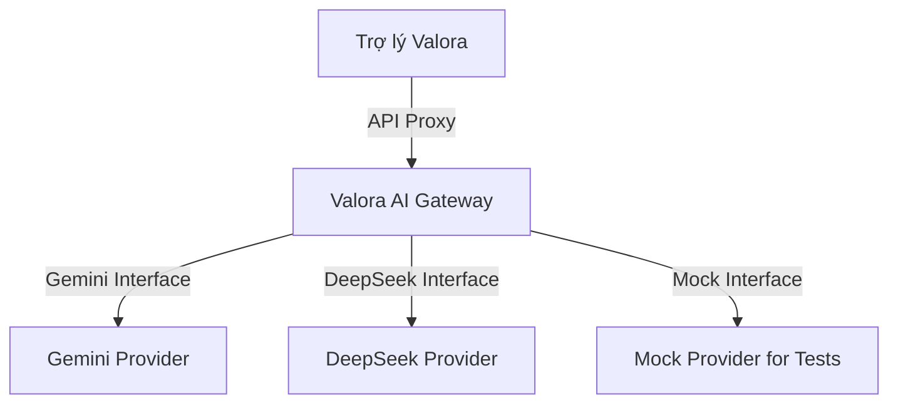

# Valora Design Book v1.3 — MVP Completion Addendum

- **Status**: Draft for Phase 2 execution (historical roadmap sequencing partially superseded)
- **Relationship to v1.2**: v1.2 remains authoritative for existing domain architecture; v1.3 adds MVP completion scope, UX rules, AI provider rules, and expansion deferrals.
- **Supersession (2026-07-15 / S13-PR-001):** Any **§7 / “Sprint 13 = AI Assistant first”** roadmap sequencing in v1.3 is superseded by Design Book **v1.4** and the Design Authority Index. Active order is S13 Adaptive Intake + Column Mapping Memory → S14 Asset Identity Memory → S15 dossiers → S16 audited AI suggestions. Vietnamese-first UX, Astryx, MVP module freeze, and human-in-the-loop AI rules in this document **remain in force**.

---

## 1. MVP Scope Freeze

### 1.1 In-Scope MVP Modules
The Valora MVP is strictly focused on a closed-loop asset valuation workflow:
- **Excel Import Pipeline**: Local bulk template ingest.
- **Data Validation Engine**: Schema verification and quality checks.
- **Live Workbench Data Loop**: Real-time asset synchronization.
- **Asset Context Drawer**: Side-by-side metadata inspection.
- **Inline Draft Editing**: On-the-fly value modifications.
- **Human Commit, Review & Approval**: Strict role-gated quality control actions.
- **AI-Assisted Suggestions**: Valuation helper cards and taxonomy matches.
- **Draft Report Generation**: Initial document compilation.
- **Real pilot authentication**: Production-ready RBAC hooks.

### 1.2 Out-of-Scope (Deferred Expansion Registry)
To preserve engineering velocity, the following modules are deferred to Phase 3:
- **Dashboard quản trị (Management Dashboards)**: Aggregated operational analytics.
- **Doanh thu/công nợ (Revenue & Accounts Receivable Tracking)**: Billing and invoices.
- **Quản lý khách hàng/CRM (Customer CRM Expansion)**: Relationship trackers and contract management.
- **Hợp đồng & phí dịch vụ (Contract & Service Fee Management)**: Sales order processors.
- **Báo cáo quản trị (Executive Reports)**: Cross-project executive summaries.
- **Hiệu suất nhân sự (HR & Performance Analytics)**: Individual activity logs.

### Revenue Boundary Note
Customer master data may exist in Valora Core to support valuation projects. However, CRM expansion is deferred to Phase 3.

The appraised asset value is not company revenue. Revenue tracking, service fees, invoices, receivables, and contract fee management must be implemented as separate post-MVP business modules.

---

## 2. Vietnamese-First UI Contract

### 2.1 Labels & i18n Rules
- Do not hardcode English string labels inside React components.
- All user-facing text must be externalized via translation dictionaries (`i18n`).
- Core business terms must use Vietnamese translations:

| English Term | Vietnamese Business Term |
| :--- | :--- |
| Project Workbench | Bàn làm việc hồ sơ |
| Review Queue | Hàng chờ kiểm tra |
| Validation Dashboard | Bảng lỗi cần xử lý |
| Commit Edits | Lưu thay đổi chính thức |
| Autosave Checkpoint | Điểm lưu nháp |
| Submit QC | Gửi kiểm soát chất lượng |
| Connection Error | Lỗi kết nối |
| API Connected | Đã kết nối máy chủ |

---

## 3. Non-IT User Experience Rules

### 3.1 Error Masking Guidelines
- Never display SQL errors, HTTP status codes (e.g. `409 Conflict`, `403 Forbidden`, `500 Server Error`), ORM `row_version` details, `session_id` tokens, or Python stack traces to the user.
- Friendly error translations with actionable resolutions must mask all API failures.
- **Step-Based Progress Flows**: Layout must clearly present the valuation stages:
  $$\text{Nhập dữ liệu} \longrightarrow \text{Kiểm tra} \longrightarrow \text{Bổ sung giá/thông tin} \longrightarrow \text{Gửi duyệt} \longrightarrow \text{Xuất báo cáo}$$

### 3.2 Action Labels & Protection Dialogs
- Direct interactions must map to clear verbs: `Lưu nháp`, `Kiểm tra lỗi`, `Gửi duyệt`, `Xuất báo cáo nháp`, and `Khôi phục bản nháp`.
- Empty lists/screens must provide text instructions guiding the user's next action.
- Destructive actions (e.g. archiving files) must trigger confirmation dialogs.
- Prompt users to confirm before leaving layouts with unsaved draft changes.

---

## 4. Astryx Design System Contract
- The interface must rely exclusively on Astryx components and style guide directives.
- Custom styling or layout patterns are forbidden unless explicitly approved.
- Astryx tokens for spacing, corner radius, typography (Outfit/Inter fonts), forms, tables, drawers, modals, toast popups, navigation headers, and status states must be used directly.

---

## 5. AI Provider Architecture

### 5.1 Provider Interface Responsibilities
- All AI model requests must execute on the backend. Frontend assets must never store provider API credentials.
- Prompt registry must reside on the backend using unified Vietnamese instructions.
- The gateway must support rate-limiting, usage cost logging, timeout monitors, and fallback execution pipelines (e.g. failover to DeepSeek if Gemini is unavailable).

### 5.2 AI Guardrails (Human-in-the-Loop)
AI models are advisory helper assistants only. Under no circumstances may AI:
- Auto-approve asset valuations.
- Determine final appraised pricing.
- Modify underlying database source records directly.
- Commit official asset lines or submit QC states automatically.

$$\text{AI Suggestion} \longrightarrow \text{User Review} \longrightarrow \text{Accept/Reject} \longrightarrow \text{Draft Save} \longrightarrow \text{Validation} \longrightarrow \text{Human Approval}$$

---

## 6. Trợ lý Valora (Valora Assistant) Concept
- The end-user interfaces with "Trợ lý Valora", masking any provider-specific names (Gemini/DeepSeek).
- The assistant is context-aware and responds to questions in Vietnamese:
  - *"Dòng này thiếu gì?"*
  - *"Vì sao dòng này bị cảnh báo?"*
  - *"Có báo giá nào liên quan không?"*
  - *"Tài sản này giống tài sản nào trước đây?"*
  - *"Tạo ghi chú thẩm định cho dòng này"*
- Suggestions are presented as actionable cards with Accept/Reject controls.

---

## 7. Phase 2 Roadmap

- **Sprint 10**: Design Book v1.3 + Astryx Vietnamese UX Contract
- **Sprint 11**: Live Workbench Data Loop
- **Sprint 12**: Excel Import Pipeline
- **Sprint 13**: AI Assistant MVP (Gemini + DeepSeek Gateway)
- **Sprint 14**: Document Report Generation MVP
- **Sprint 15**: Real Auth + Pilot Acceptance

---

## 8. Acceptance Criteria

S10-PR-001 passes when:
- MVP scope is frozen around the closed valuation workflow.
- Deferred modules are explicitly named and excluded from Phase 2 MVP.
- Vietnamese-first UI rules are documented.
- Astryx Design System is mandatory for all MVP UI work.
- Non-IT user experience rules are documented.
- Gemini and DeepSeek are included through backend AI Provider Architecture only.
- AI guardrails require human review before any official data commit.
- Phase 2 roadmap from Sprint 10 to Sprint 15 is documented.
- No runtime behavior is changed in this PR.
- Existing backend and frontend quality gates remain passing.
