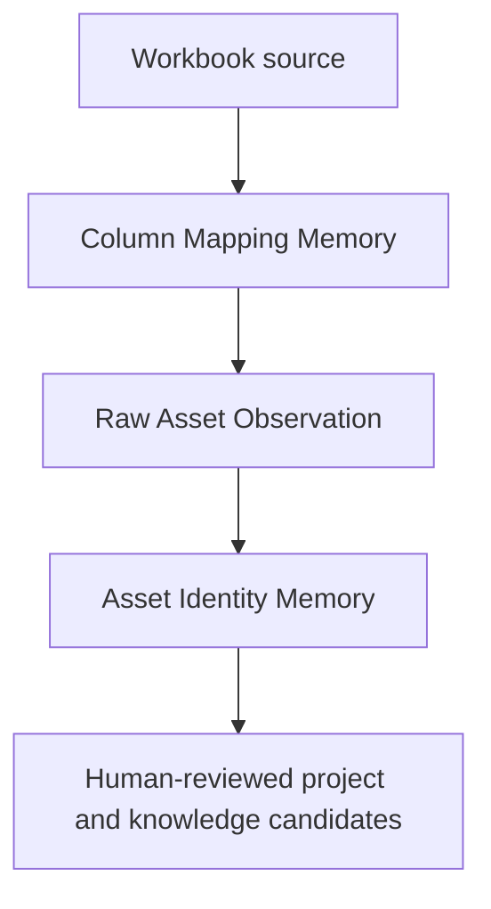

# Valora Design Book v1.4 — Adaptive Intake, Knowledge Memory and Historical Dossier Addendum

- **Status:** Owner-requested design authority, accepted for phased implementation planning on 2026-07-14; reconciled for public repo under S13-PR-001 (2026-07-15)
- **Relationship to v1.2:** v1.2-final remains authoritative for established domain boundaries.
- **Relationship to v1.3:** v1.3 remains authoritative for Vietnamese-first UX, Astryx, AI-provider architecture and MVP scope; this addendum supersedes v1.3 §7 roadmap sequencing (“AI Assistant first”).
- **Relationship to S12:** S12 upload, staging, validation and Apply v1 are **implemented and merged** (`s12-pr-004-v1`). This addendum defines an **additive** Adaptive Intake path and does not silently change Apply semantics.
- **Implementation gate:** This document authorizes decomposition and planning. Runtime changes must wait for S13-PR-001 independent design audit and owner merge, then use ADR 0030–0032, assigned task IDs, migrations, tests and independent audit. **No runtime is authorized by this document alone.**
- **Privacy:** Public text uses anonymized fixture **PD-001** only. Real client workbooks and reports never enter the public repository.

---

## 1. Why this addendum exists

Real valuation dossiers show that the original Excel intake and document-intelligence foundations are insufficient for Valora's primary knowledge goal.

The verified sample dossier consists of:

```text
customer_asset_list.xls
+
final_appraisal_report.docx
```

The sample proves the following gaps:

1. Customer workbooks may use legacy `.xls`, not only `.xlsx`.
2. The first non-empty row may be a report title rather than a table header.
3. Column meaning cannot be resolved from a fixed alias list alone.
4. A meaningful column may have a blank header.
5. Section, subtotal, total and note rows must not become asset lines.
6. Mapping decisions must be reviewed and remembered by customer/template.
7. Customer raw asset wording and appraiser-standardized wording must coexist.
8. Historical Excel and final Word/PDF reports must be ingested as one paired dossier.
9. Technical, quote-comparison and final-result rows need source-backed alignment.
10. Document Intelligence needs an actual extraction runtime, not only persistence CRUD.
11. Human-confirmed corrections must improve future suggestions without uncontrolled online training.

These gaps are central product requirements, not optional import conveniences.

---

## 2. Product outcome

Valora must support two related operating modes.

### 2.1 Historical paired-dossier bootstrap

```text
Customer Excel raw list
+ final Word/PDF report
+ supporting evidence where available
→ extract candidates
→ align raw and standardized rows
→ human review
→ candidate knowledge
→ approved, versioned knowledge
```

### 2.2 New Excel-only intake

```text
New customer Excel
→ identify workbook/table structure
→ confirm column meanings
→ create immutable raw observations
→ suggest existing asset identities
→ human confirm/create new
→ existing validation and official Apply gates
```

Historical dossiers provide the initial supervised examples. The two memories defined below make those examples reusable for future dossiers.

---

## 3. Architectural decision: two separate memories

Valora shall implement two bounded, auditable memories connected through an immutable raw observation boundary.



| Memory | Owns | Must not own |
| --- | --- | --- |
| Column Mapping Memory | Workbook structure, sheet/table discovery, header region, column roles, row classes, mapping profiles and decisions | Canonical asset identity, taxonomy approval, supplier quote or final price |
| Asset Identity Memory | Raw wording, contextual aliases, extracted identity attributes, candidates, score explanations and identity decisions | Workbook column interpretation, final price approval, document rendering |

The memories may exchange anomaly signals, but neither may directly mutate the other's active decision records.

---

## 4. Non-negotiable data layers

The following layers remain distinct and traceable:

| Layer | Meaning | Example from the sample |
| --- | --- | --- |
| Source raw | Exact customer/file value and locator | Excel B cell text, original `Km`, blank-header I note |
| Parsed/mapped candidate | Structure inferred or user-mapped but not official | “B is raw asset name”, “I is evidence note” |
| Appraiser normalization | Standardized name and technical attributes | Word technical table |
| Market observation | Supplier quote, source and time | Three supplier columns in the Word comparison table |
| Price proposal | Appraiser working/proposed price | Excel H `GIÁ TĐ` |
| Professional decision | Final appraised price and rationale | Final result in the report |
| Approved knowledge | Curated identity/specification/price precedent | Active KnowledgeVersion after review |

No layer may overwrite another. Normalization produces a new linked representation; it never destroys the source representation.

---

## 5. Adaptive workbook intake v2

### 5.1 Relationship to S12 v1

S12 v1 currently performs parsing and deterministic mapping during upload. Adaptive Intake v2 introduces an explicit analysis and mapping-review phase before staging values are considered ready for validation.

```text
Create batch
→ receive immutable source artifact
→ analyze workbook structure
→ propose sheet/header/table/column mapping
→ human confirms mapping
→ materialize staging rows from the confirmed mapping snapshot
→ existing validation concepts
→ existing human-confirmed Apply concepts
```

S12 Apply v1 is not changed by this document. Any future change to Apply fields or eligibility requires a new contract version and ADR.

### 5.2 Workbook adapters

The intake boundary shall accept `.xlsx` and `.xls` through format-specific adapters that expose one neutral, bounded cell/structure interface.

Required adapter behavior:

- preserve the original uploaded file and checksum;
- never execute formulas, macros, VBA or external links;
- enforce request, file, row, column, cell and expansion limits;
- expose sheet names, merged regions, cell coordinates, values and safe type metadata;
- preserve duplicate and blank headers by position;
- use value-only/cached-value semantics;
- fail closed on encrypted, malformed or unsupported content;
- never use an Office desktop process as the domain parser.

The exact `.xls` parsing dependency is selected in a security/dependency spike under ADR 0030. The architectural contract requires capability and safety, not a specific library.

### 5.3 Immutable source snapshot

Adaptive mapping must not depend on re-reading an untracked temporary upload. Each import generation needs a source artifact or equivalent immutable snapshot containing:

```text
organization scope
project/import batch
original filename
content type
checksum
object/storage reference
adapter/version metadata
sheet/structure snapshot version
created actor/time
```

Raw cell values remain source evidence and are never rewritten when mappings change.

### 5.4 Sheet and table discovery

The first non-empty row rule is forbidden for Adaptive Intake v2.

The discovery engine shall score candidate regions using multiple signals:

- row density and number of non-empty columns;
- known business header vocabulary;
- consistency of subsequent data rows;
- numeric/text/unit/URL patterns;
- merged title rows above the table;
- serial-number patterns;
- section and total markers;
- previously confirmed customer/template profiles.

Discovery output is a candidate containing:

```text
sheet
header_start_row
header_end_row
data_start_row
candidate_table_bounds
confidence
reasons
rule/model version
```

If candidates conflict or confidence is insufficient, the user selects the sheet/header region in the mapping-review UI.

### 5.5 Semantic column roles

The minimum role registry is:

```text
row_number
raw_asset_name
raw_description
unit
quantity
customer_unit_price
customer_amount
reference_value
appraiser_proposed_price
evidence_note
ignore
```

Roles are semantic. They are not tied to letters such as B, H or I.

Column-role proposals may use:

- exact/normalized header vocabulary;
- content patterns and data types;
- relative position and neighboring columns;
- customer/template history;
- deterministic rules;
- an approved AI task for ambiguous cases.

A blank header remains eligible for a role proposal when content and context support it.

### 5.6 Row classification

Each physical row is classified before asset staging materialization:

```text
asset
section
subtotal
total
note
empty
unresolved
```

Only confirmed `asset` rows become asset staging rows. Section text may be carried as contextual metadata. `subtotal`, `total`, `note`, `empty` and `unresolved` never silently become official asset lines.

### 5.7 Mapping review gate

AI/rule output is advisory. A mapping decision requires an authenticated user and an append-only decision record.

```text
proposal
→ user accepts/corrects/rejects
→ confirmed mapping snapshot
→ staging materialization
```

An active profile may prefill a future import, but it never removes the final human confirmation and Apply gates.

---

## 6. Column Mapping Memory

### 6.1 Scope hierarchy

Mapping retrieval priority is:

```text
same organization + same customer + same template fingerprint
→ same organization + same customer + similar template
→ approved organization template
→ deterministic/AI proposal
```

No mapping profile is learned across organizations automatically.

### 6.2 Conceptual entities

#### ImportSourceArtifact

Stores immutable source-file identity and safe storage metadata.

#### WorkbookStructureSnapshot

Stores versioned structural facts used to reproduce discovery and fingerprinting.

#### ColumnMappingProfile

```text
organization_id
customer_id
template/fingerprint identity
profile_version
status: candidate | active | superseded | rejected
sheet selection rule
header region
data-region and row-classification rules
confirmed_by / confirmed_at
supersedes_profile_id
```

#### ColumnMappingField

```text
profile_id
source column index/letter
original header
semantic role
expected type/pattern
required flag
approved transformation
proposal source and confidence
```

#### ColumnMappingDecision

Append-only record of proposal, final decision, actor, reason, source import, rule/model/prompt version and timestamp.

#### ColumnMappingProfileUsage

Records which profile version and exact mapping snapshot were used for each batch.

### 6.3 Fingerprint rules

Fingerprinting shall use stable structural features rather than filename alone. It may include:

- sheet and table geometry;
- normalized header-region tokens;
- merged-cell layout;
- column count and relative order;
- type/pattern density;
- approved customer/template identity.

The fingerprint must avoid embedding unrestricted sensitive cell payloads.

### 6.4 Version and correction behavior

- Confirming a new structure creates a new profile version.
- Correcting an active profile never rewrites a prior import's mapping snapshot.
- Conflicting profiles are reviewable; the system must not silently pick one.
- A superseded profile remains available for audit/replay.

---

## 7. Raw Asset Observation boundary

`RawAssetObservation` is the stable bridge between the two memories and between current-project intake and historical bootstrap.

Minimum fields:

```text
organization_id
customer_id
source artifact/file
source sheet/table/row/cell locator
source staging row when applicable
raw asset text
raw description
raw unit and quantity
section/context text
mapping profile/snapshot version
created actor/time
```

Rules:

- source text is immutable;
- normalized/search text is stored separately or derived;
- an observation may exist before a ProjectAssetLine;
- historical observations need not masquerade as active project lines;
- official project lines and knowledge candidates reference the observation through explicit lineage.

---

## 8. Asset Identity Memory

### 8.1 Purpose

Asset Identity Memory resolves a raw observation into ranked CanonicalAsset/AssetVariant/Taxonomy candidates while preserving the original wording and the human decision.

### 8.2 Existing domain reuse

The following remain authoritative and must be reused rather than duplicated:

- `CanonicalAsset`;
- `AssetVariant`;
- curated `AssetAlias`;
- `IdentityCandidate` and `SimilarityScore` concepts;
- `IdentityReviewItem` and `IdentityDecisionLog` concepts;
- duplicate/merge review boundaries.

### 8.3 Contextual aliases

Customer-specific or organization-specific wording must not automatically become a global curated alias.

`ContextualAssetAlias` conceptually contains:

```text
organization_id
customer_id (optional for organization scope)
raw_alias and normalized_alias
canonical_asset_id / asset_variant_id
attribute signature
status: candidate | active | conflicted | superseded
source identity decision
confirmed actor/time
usage metadata
```

Retrieval priority is:

```text
same customer contextual alias
→ organization contextual alias
→ curated AssetAlias
→ canonical/variant names and codes
→ deterministic fuzzy/attribute retrieval
→ AI reranking candidate
```

### 8.4 Matching pipeline

```text
RawAssetObservation
→ derive normalized search representation
→ extract identity attributes
→ retrieve top-k candidates
→ score explainable components
→ detect conflicts
→ optional AI rerank/explain
→ human review
→ append identity decision
```

Candidate features may include:

- name and token similarity;
- contextual/curated alias match;
- brand and manufacturer;
- model/product code;
- voltage, power, capacity, dimensions, material and other Asset DNA;
- taxonomy proximity;
- customer/organization precedent;
- conflict and missing-attribute penalties.

Price is not a primary identity feature because it is time-dependent. It may be used only as a weak diagnostic signal.

### 8.5 Human outcomes

```text
confirm existing canonical/variant
confirm with corrected attributes
create new variant candidate
create new canonical candidate
create contextual alias candidate
defer/unresolved
reject suggestion with reason
```

High confidence may preselect or support explicit batch review. It never constitutes automated official approval. This rule supersedes any prior wording that made high-confidence candidates eligible for automated batch approval.

### 8.6 Feedback contract

Only a committed human decision can create learning feedback.

Positive feedback:

- accepted identity;
- corrected-and-accepted identity;
- approved contextual alias;
- approved create-new/variant decision.

Negative feedback:

- explicitly rejected candidate and reason;
- conflict decision;
- mapping/identity correction.

The following are not learning evidence:

- temporary UI selection;
- unreviewed candidate;
- failed task output;
- auto-rejected candidate without human decision;
- rolled-back transaction.

Feedback is append-only and versioned. It may update retrieval indexes immediately, but model/rule weights are released only through offline evaluation and a versioned deployment. Per-click online model training is forbidden.

---

## 9. Paired historical dossier aggregate

### 9.1 Aggregate boundary

Historical Excel and Word/PDF files are grouped in a `DossierBundle` aggregate rather than being treated as unrelated uploads or forced into an active-project workflow.

Minimum dossier metadata:

```text
organization and customer
dossier/report identifiers
valuation/report dates
source status and completeness
bootstrap batch
review/activation status
created/reviewed actors
```

### 9.2 Source file roles

```text
customer_asset_list
final_appraisal_report
comparison_table
supplier_quote
catalogue
approval_or_qc
other_evidence
```

Each source keeps checksum, immutable object identity and access policy.

### 9.3 Extracted table roles

The minimum recognized table roles are:

```text
excel_customer_asset_table
word_technical_asset_table
word_quote_comparison_table
word_final_result_table
```

Each extracted row and field keeps a file/page/table/row/cell locator where available.

### 9.4 Dossier row alignment

`DossierRowAlignment` links one raw Excel row to zero or one candidate row in each report table and to a raw asset observation.

Alignment features include:

- section and STT;
- source order;
- normalized/raw name similarity;
- unit and quantity;
- extracted attributes;
- table role;
- candidate conflicts and missing-row penalties.

Row order alone is never sufficient production authority. Removed, inserted, split, merged or reordered report rows must be represented explicitly and reviewed.

Alignment states:

```text
candidate
review_required
confirmed
rejected
unresolved
```

### 9.5 Price and evidence semantics

- Excel customer/working price remains a source observation.
- Excel H-like price is a `PriceProposalObservation`, not a final decision.
- Each supplier price becomes an individual QuoteLine candidate with supplier, unit, currency, observation/quote date and source locator.
- The final Word result becomes an AppraisedPriceDecision candidate only after review and rationale/evidence linkage.
- Blank-header evidence notes remain immutable raw notes and may later resolve to typed prior-dossier, web, supplier/catalogue or free-text evidence.
- Rounding and unit transformations are recorded, never applied silently to raw data.

### 9.6 Knowledge activation

Historical extraction produces candidates only:

```text
identity candidate
contextual alias candidate
technical specification candidate
quote batch/line candidate
appraised price decision candidate
knowledge version candidate
```

Activation requires the existing domain-appropriate review and approval commands. Bulk SQL insertion into active knowledge tables is forbidden.

---

## 10. Document extraction runtime

Document Intelligence must progress from persistence/API foundations to an actual runtime pipeline.

Required runtime stages:

```text
classify document
→ parse DOCX/PDF layout and tables
→ OCR only when required
→ extract fields/tables with source locators
→ assign table roles
→ create reviewable candidates
→ align dossier rows
```

Runtime requirements:

- deterministic DOCX table extraction baseline before AI enhancement;
- bounded PDF/OCR processing with explicit time/resource limits;
- source page/table/row/cell lineage;
- extraction schema validation;
- model/rule/adapter version metadata;
- no official mutation from parser or AI task;
- retry and failure behavior that never destroys prior reviewed extraction.

---

## 11. AI task registry additions

The following tasks are permitted only through the audited backend AI Gateway:

### AI-TASK-COLUMN-MAPPING-SUGGEST

```text
Input: structure snapshot, column samples, active mapping profiles
Output: column-role and row-classification candidates with reasons
Review: required
Official write: no
```

### AI-TASK-ASSET-IDENTITY-SUGGEST

Existing task extended to accept `RawAssetObservation`, contextual aliases and deterministic retrieval candidates. Human review remains required.

### AI-TASK-DOC-EXTRACT-TABLES

```text
Input: ParsedDocument/layout/OCR result
Output: extracted table/row candidates with locators
Review: required
Official write: no
```

### AI-TASK-DOSSIER-ROW-ALIGN-SUGGEST

```text
Input: extracted rows from approved dossier source roles
Output: alignment candidates, conflicts and explanations
Review: required for knowledge/bootstrap use
Official write: no
```

External AI must not be the only available path. Deterministic parsing, retrieval and review remain usable when AI is unavailable.

---

## 12. Vietnamese-first Astryx UX

### 12.1 Mapping review

User-facing step: **Xác nhận cấu trúc file**.

Required elements:

- selected sheet and detected table region;
- preview of source rows;
- Vietnamese role selector per source column;
- `Đã nhận diện`, `Cần kiểm tra`, `Chưa xác định` states;
- visible handling for blank headers;
- row-type preview for section/total/note;
- `Ghi nhớ cấu trúc này cho khách hàng` control;
- explicit confirm action before staging materialization.

### 12.2 Asset identity review

User-facing step: **Đối chiếu tài sản**.

Required elements:

- raw customer wording and source locator;
- extracted attributes;
- top-k candidate list;
- match reasons and differences;
- conflict/unit/model warnings;
- `Xác nhận`, `Chọn tài sản khác`, `Tạo biến thể`, `Tạo tài sản mới`, `Để xử lý sau` actions;
- explicit batch confirmation, never silent auto-approval.

All components use Astryx patterns and i18n dictionaries. Technical confidence details may be available in an explanation drawer but must not replace plain Vietnamese guidance.

---

## 13. State and command boundaries

Conceptual adaptive-intake lifecycle:

```text
created
→ source_received
→ structure_analyzed
→ mapping_review_required
→ mapping_confirmed
→ parsed/staged
→ validated/ready_for_review
→ applied
```

Exact enum/migration compatibility is defined in implementation ADR/task contracts.

Required command concepts:

```text
AnalyzeWorkbookStructure
ProposeColumnMapping
ConfirmColumnMapping
MaterializeConfirmedMappingToStaging
GenerateAssetIdentityCandidates
ConfirmAssetIdentityDecision
CreateDossierBundle
ExtractDossierDocument
GenerateDossierRowAlignments
ConfirmDossierRowAlignment
PromoteReviewedBootstrapCandidates
```

Every command derives actor and tenant server-side, uses explicit permissions and emits an append-only audit event or domain decision log as applicable.

---

## 14. Security, privacy and audit

- Organization boundaries are enforced on source artifacts, profiles, observations, aliases, candidates, decisions and AI context.
- Customer-scoped memory is not silently shared with another customer.
- AI context contains only tenant-authorized source references and the minimum necessary content.
- Raw cell/document payloads are not copied into general audit-event payloads.
- Source files and reviewed extraction remain immutable/versioned.
- Mapping and identity decisions record actor, time, before/after proposal, reason and rule/model version.
- Derived fingerprints and indexes are rebuildable and are not the sole lineage record.
- Secret/provider credentials remain backend-only.

---

## 15. Revised Phase 2 roadmap

This section supersedes v1.3 §7 sequencing.

| Sprint | Scope |
| --- | --- |
| S12 closure | Finish S12-PR-004 CI, independent re-audit and owner merge; no new adaptive runtime mixed into that PR |
| Sprint 13 | Adaptive Intake foundation and Column Mapping Memory |
| Sprint 14 | Raw Asset Observation, contextual Asset Identity Memory and feedback |
| Sprint 15 | DossierBundle, DOCX extraction runtime, row alignment and historical bootstrap pilot |
| Sprint 16 | AI Assistant runtime: Gemini/DeepSeek Gateway plus column mapper and asset reranker tasks |
| Sprint 17 | Document Report Generation MVP |
| Sprint 18 | Real Auth hardening and Pilot Acceptance |

The detailed PR order and gates are defined in `docs/remediation/S13_S16_ADAPTIVE_INTAKE_KNOWLEDGE_MEMORY_REMEDIATION_PLAN.md`.

---

## 16. Acceptance fixture: PD-001 paired dossier

The sample shall become the first repository-safe test fixture or synthetic/redacted equivalent, subject to data-rights policy.

Required proof:

1. Accept `.xls` through the approved bounded adapter.
2. Detect or propose sheet `PD-001`.
3. Detect header row 5 rather than title row 1.
4. Propose B/C/D/H/I semantics, including blank-header I as evidence note.
5. Classify `PHẦN ĐIỆN`, `PHẦN NƯỚC` as section rows.
6. Exclude subtotal/total/note rows from asset staging.
7. Preserve 49 raw asset observations with locators.
8. Extract 49 technical rows, 147 supplier quote observations and 49 final-result rows from the report.
9. Create 49 reviewable alignments for the sample without assuming order is universal.
10. Flag `Km` versus `Mét` as a meaningful unit conflict.
11. Record the epoxy price rounding transformation without changing raw H.
12. Preserve the five materially changed raw/standardized names as supervised examples.
13. A second structurally similar import retrieves the confirmed mapping profile.
14. A new Excel-only observation retrieves top-k identity candidates from approved history.
15. No AI/parser result becomes official without explicit human commands.

---

## 17. Quality metrics

Minimum metrics:

```text
sheet-selection accuracy
header-region accuracy
column-role top-1 accuracy
row-classification accuracy
mapping correction rate
Excel–Word row-alignment accuracy
asset candidate recall@k
top-1 human acceptance rate
false high-confidence rate
source-locator completeness
quote supplier/time/evidence completeness
review time per dossier and per row
reuse accuracy on the next import
```

Numeric thresholds are established from a 20–50 dossier pilot corpus. One sample must not freeze production confidence thresholds.

---

## 18. Explicit non-goals for the foundation sprints

- no online/per-click model training;
- no AI auto-approval or auto-Apply;
- no automatic cross-tenant learning;
- no bulk activation of historical knowledge without review;
- no use of price as the primary identity key;
- no rewriting S12-PR-004 Apply v1 field mapping;
- no full CRM/revenue expansion;
- no dependence on Word/Excel as the official source of truth.

---

## 19. Completion gate for this addendum

Implementation may claim v1.4 completion only when:

- ADR 0030–0032 are implemented and audited;
- each PR cites this addendum and its specific ADR/task contract;
- `.xls`, header discovery, semantic mapping and row classification pass acceptance;
- mapping and identity review UX is Vietnamese-first and Astryx-aligned;
- paired dossier extraction/alignment is source-backed and reviewable;
- feedback is append-only and human-confirmed;
- deterministic baselines work without external AI;
- AI tasks are audited, tenant-scoped and advisory;
- PostgreSQL and relevant frontend/runtime gates pass with no hidden skips;
- the canonical handoff truthfully records remaining limitations.
