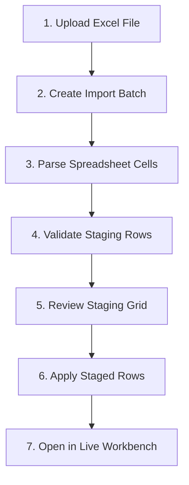

# Excel Import Staging Contract

- **Status**: Authoritative API & Domain Contract
- **Sprint Target**: S12-PR-001

---

## 1. Purpose
This document establishes the architecture, lifecycle, and staging boundary for importing asset lists from Excel spreadsheets into Project Valora. It ensures that uploaded records are staged, mapped, and validated within a secure environment before they can be promoted to the official valuation master records.

## 2. Relationship to Authoritative Contracts
- **Relationship to Design Book v1.3**: Implements the staging boundary of the Excel Import Pipeline module. Aligns with the Non-IT UX registry to present clear validation errors. Enforces AI-assistance guardrails (AI cannot auto-approve or auto-import).
- **Relationship to Sprint 11 Live Workbench Loop**: Staged records do not appear in the Live Workbench grid. Staged data remains in a separate sandbox layer. A separate, future "Apply" action will copy valid staging lines to the official `ProjectAssetLine` table, which the Workbench then loads.
- **Relationship to Vietnamese i18n Dictionary**: Keys for validation results and import status tags are translated to user-friendly Vietnamese labels (e.g., `Đang chờ kiểm tra`, `Hợp lệ`, `Không hợp lệ`, `Có cảnh báo`).

## 3. Import Lifecycle
The import process is structured across the following stages:



*Note: S12-PR-001 implements step 2 and defines the structures for steps 3 and 4. Actual parsing, file upload streams, and the apply-to-workbench action (steps 5-7) are deferred to subsequent PRs.*

## 4. Staging vs. Official Data Boundary
Under no circumstances do import staging rows write to, mutate, or affect the official `ProjectAssetLine` table.
- **Read Isolation**: Staged rows are stored in the `project_asset_import_staging_rows` table. They are completely excluded from the `/api/v1/projects/{project_id}/asset-lines` endpoint.
- **Write Isolation**: Staging data is read-only for standard valuation calculations. It exists solely to allow mapping corrections and validation review by users.

## 5. Excel Source Handling & Raw Value Preservation
- **Treat Cells as Values**: All cells are treated as raw string values. Formulating or running Excel macro logic is forbidden.
- **Traceability**: The database keeps a copy of the raw cell values originally retrieved from the spreadsheet column positions in the `raw_values` JSON dictionary. This ensures complete auditability and error diagnostic capabilities.
- **No Absolute Path Exposure**: File path mappings on the server are masked. The batch stores only the user-visible filename (e.g., `assets.xlsx`) to prevent directory traversal or internal path leakage.

## 6. Column Mapping Assumptions
During ingestion, the parser maps spreadsheet columns to staging row target fields:
- `asset_name` -> `proposed_asset_name`
- `description` -> `proposed_description`
- `quantity` -> `proposed_quantity`
- `unit` -> `proposed_unit`
- `raw_price` -> `proposed_raw_price`
- `currency` -> `proposed_currency`

These mapped properties are validated prior to being applied to official tables.

## 7. Validation Status Model
Staged rows are assigned one of four validation statuses:
- **`pending`** (`Đang chờ kiểm tra`): The row has been parsed but validation rules have not run yet.
- **`valid`** (`Hợp lệ`): The row has passed all schema checks and is ready to be applied.
- **`warning`** (`Có cảnh báo`): The row has minor validation discrepancies but can be applied (with warnings noted).
- **`invalid`** (`Không hợp lệ`): The row contains severe validation errors (e.g. invalid quantity format, missing asset name) and cannot be applied until corrected.

## 8. Error Behavior & Non-IT Shielding
- Parser exceptions or data type mismatches are converted into clean, business-friendly errors stored in the `validation_errors` JSON array.
- Technical details such as ORM constraint names, SQL trace dumps, or parser library exception traces are kept on the server and never exposed in the API.

## 9. RBAC & Multi-Tenant Scoping
- **Multi-Tenant Scoping**: All routes enforce active `organization_id` verification. Users cannot create, retrieve, or query batches and staging rows associated with projects belonging to another tenant organization.
- **Permissions**:
  - `POST /api/v1/projects/{project_id}/asset-imports`: Requires `workbench:edit` (as this prepares data modification).
  - `GET /api/v1/projects/{project_id}/asset-imports`: Requires `project:read`.
  - `GET /api/v1/projects/{project_id}/asset-imports/{batch_id}/rows`: Requires `project:read`.

## 10. AI Guardrails
AI integration is strictly advisory. AI cannot auto-map, auto-approve, or auto-apply import staging rows. All final mappings and promotion to official records require explicit human confirmation.

## 11. API Route Contract

### A. Create Import Batch Metadata
- **Route**: `POST /api/v1/projects/{project_id}/asset-imports`
- **Permission**: `workbench:edit`
- **Request Body**:
  ```json
  {
    "source_filename": "assets.xlsx",
    "source_sheet_name": "Sheet1"
  }
  ```
- **Response Shape**:
  ```json
  {
    "id": "uuid-string",
    "project_id": "uuid-string",
    "status": "created",
    "source_filename": "assets.xlsx",
    "source_sheet_name": "Sheet1",
    "total_rows": 0,
    "valid_rows": 0,
    "invalid_rows": 0,
    "warning_rows": 0,
    "created_at": "iso-datetime",
    "updated_at": "iso-datetime"
  }
  ```

### B. List Import Batches
- **Route**: `GET /api/v1/projects/{project_id}/asset-imports`
- **Permission**: `project:read`
- **Response Shape**:
  ```json
  [
    {
      "id": "uuid-string",
      "project_id": "uuid-string",
      "status": "ready_for_review",
      "source_filename": "assets.xlsx",
      "source_sheet_name": "Sheet1",
      "total_rows": 120,
      "valid_rows": 98,
      "invalid_rows": 12,
      "warning_rows": 10,
      "created_at": "iso-datetime"
    }
  ]
  ```

### C. List Staging Rows
- **Route**: `GET /api/v1/projects/{project_id}/asset-imports/{batch_id}/rows`
- **Permission**: `project:read`
- **Query Params**:
  - `limit` (default 50)
  - `offset` (default 0)
  - `validation_status` (optional: pending | valid | invalid | warning)
- **Response Shape**:
  ```json
  {
    "project_id": "uuid-string",
    "import_batch_id": "uuid-string",
    "items": [
      {
        "id": "uuid-string",
        "import_batch_id": "uuid-string",
        "source_row_number": 12,
        "proposed_asset_name": "Máy xúc Komatsu PC200",
        "proposed_quantity": "1",
        "proposed_unit": "cái",
        "proposed_raw_price": "100000000",
        "proposed_currency": "VND",
        "validation_status": "warning",
        "validation_errors": [],
        "validation_warnings": [
          {
            "field": "year",
            "message_key": "excel.validation.year_missing"
          }
        ]
      }
    ],
    "total": 1,
    "limit": 50,
    "offset": 0
  }
  ```

---

## 12. S12-PR-002: Excel File Upload & Parser Intake
To enable ingestion of Excel spreadsheets into the staging model, the following specifications are implemented:

- **Route**: `POST /api/v1/projects/{project_id}/asset-imports/{batch_id}/upload`
- **Request Format**: `multipart/form-data` with form field `file`
- **Permission**: `workbench:edit`
- **Accepted File Type**: `.xlsx` only. Content verification processes file headers and extension type; invalid formats trigger a friendly Vietnamese error.
- **Value-Only Parsing**: `openpyxl` is loaded in read-only mode with `data_only=True` to extract cell values and cached evaluations. Execution of formulas, macros, VBA scripts, or external workbook links is strictly disabled.
- **Header Normalization**: Columns are trimmed, converted to lowercase, and normalized using underscores (e.g. `Tên tài sản` -> `ten_tai_san` / `tên_tài_sản`).
- **Deterministic Column Mapping**:
  - `proposed_asset_name` maps `asset_name`, `ten_tai_san`, `tên_tài_sản`, `name`
  - `proposed_description` maps `description`, `mo_ta`, `mô_tả`, `specification`, `thong_so`, `thông_số`
  - `proposed_quantity` maps `quantity`, `so_luong`, `số_lượng`, `qty`
  - `proposed_unit` maps `unit`, `don_vi`, `đơn_vị`
  - `proposed_raw_price` maps `raw_price`, `gia_goc`, `giá_gốc`, `cost`, `price`
  - `proposed_currency` maps `currency`, `tien_te`, `tiền_tệ`
- **Staging Row Creation**: Parsed rows create isolated `ProjectAssetImportStagingRow` entries defaulting to `pending` validation state. Fully empty sheet lines are skipped. Absolute row count limit is capped at 5,000 rows.
- **Batch Counters**: The upload endpoint returns the updated `ProjectAssetImportBatchResponse` with modified `status` (`parsed`) and updated `total_rows`.
- **Immutability**: Staging ingestion remains decoupled from official data. No mutations occur on the `ProjectAssetLine` table.

## 13. S12-R-006: Hardened Security, Limits, and Concurrency Policies
To protect against system degradation, Denial of Service (DoS), data inconsistency, and race conditions, the following strict intake policies are enforced:

### A. HTTP Request-Size Validation
- Enforces strict Content-Length checks at the boundary of request validation.
- Missing headers default to safe streaming up to a strict 10 MiB file size limit.
- Negative or malformed Content-Length values are immediately rejected with an HTTP 400 response.
- Content-Length values exceeding 12 MiB (12,582,912 bytes) are rejected immediately with an HTTP 413 response.
- Enforces an actual file size cap of 10 MiB (10,485,760 bytes) and a spool-to-disk threshold of 1 MiB (1,048,576 bytes).

### B. ZIP Archive Security and Expansion Limits
- ZIP entries are capped at 2,048 members.
- Total uncompressed ZIP expansion size is capped at 100 MiB.
- Attempts to upload encrypted archives, external links, macro/VBA parts, or unsafe directory paths (`..`, absolute paths) are blocked with a friendly Vietnamese validation error.

### C. Spreadsheet Row, Column, and Character Limits
- Capped at exactly 100 columns. Any sheet containing 101 or more columns is rejected.
- Capped at exactly 5,000 data rows. Any sheet containing 5,001 or more data rows is rejected.
- Capped at a maximum physical row limit of 5,100 rows.
- Capped at 10,000 characters per cell.
- Capped at 100,000 characters per row.
- The parser scans for headers up to a maximum of 100 rows. Genuinely blank rows preceding the header row are skipped and do not count toward data rows, but the header row must reside within the first 100 physical rows.

### D. Transaction Safety and Concurrency Control
- **Pessimistic Concurrency**: Acquires a pessimistic row-level write lock (`SELECT ... FOR UPDATE`) on the `ProjectAssetImportBatch` record immediately when the upload begins.
- **Separate-Session Semantics**: same-batch upload operations are serialized by a PostgreSQL row lock.
- **Transactional Savepoint Atomicity**: All spreadsheet parsing and staging row replacements run within a nested transaction savepoint (`db.begin_nested()`). Any validation limit breach or runtime exception rolls back all modifications to this savepoint, leaving previously imported staging rows intact.
- **Audit Event Persistence & Serialization**: Both upload success and parser failure audit events are persisted atomically to the database. Failure logs include the exception code and previous staging row count. Stale failures from older concurrent generation processes are prevented from overwriting newer successfully parsed states by checking a pre-operation batch fingerprint. If a commit failure occurs on savepoint release, the transaction rolls back, and the recovery worker reacquires the lock `FOR UPDATE` to verify the fingerprint remains unchanged before writing the failure event.
- **Official Data Immutability**: All existing `ProjectAssetLine` records, their IDs, quantities, names, and version fields remain strictly immutable throughout the Excel ingestion transaction. Any transaction fault or outer commit failure rollback guarantees that no partial changes or draft states leak to ProjectAssetLine.


## 14. S12-PR-003: Deterministic Staging Validation Engine (v1)

**Authority:** Product/engineering owner decision package 2026-07-13.
**Supersedes for validation v1:** the historical illustrative `year_missing` warning example in §11C — validation v1 produces **no warnings** and does not implement year validation.

### A. Trigger, endpoint, permission
- **Route:** `POST /api/v1/projects/{project_id}/asset-imports/{batch_id}/validate`
- **Permission:** `workbench:edit`
- **Request body:** none
- **Response:** `ProjectAssetImportBatchResponse`
- **Invocation:** explicit and synchronous only. No automatic validation after upload in v1. No worker/background job.

### B. Allowed and rejected batch source states
- **Allowed:** `parsed`, `validation_failed`, `ready_for_review`
- **Rejected (HTTP 409, zero mutation, zero audit):** `created`, `parsing`, `failed`, `applied`
- **Client detail (409):** `Lô nhập liệu chưa ở trạng thái có thể kiểm tra.`
- Unknown / cross-tenant / wrong-project / missing batch: established safe `404`.

### C. Batch outcome semantics
On **successful engine execution**:
- Batch status becomes `ready_for_review` even when one or more rows are business-invalid.
- Business-invalid rows are communicated via row `validation_status` and batch counters.
- `validation_failed` is reserved for **validation-engine/system failure**, not ordinary invalid business data.
- Zero staging rows: success → `ready_for_review` with all counters `0`.

### D. Rule catalog v1 (`rule_set_version`: `s12-pr-003-v1`)
1. **V1-001 asset name required** — field `proposed_asset_name`; trim for evaluation only; missing/null/empty/whitespace-only → invalid; do not rewrite stored value.
   - `message_key`: `excel.validation.asset_name_required`
   - `message`: `Tên tài sản là bắt buộc.`
2. **V1-002 quantity format** — field `proposed_quantity`; optional; null/empty/whitespace-only → valid; if present, trimmed value must parse as finite decimal (signed/zero/scientific OK when Decimal recognizes); NaN/±Infinity/malformed → invalid; no positivity/range/unit rules; do not rewrite stored value.
   - `message_key`: `excel.validation.quantity_invalid`
   - `message`: `Số lượng không đúng định dạng số.`

Row classification:
- Any approved error → `invalid`
- No approved errors → `valid`
- Both errors: store in order asset name, then quantity
- `validation_warnings` is always `[]` in v1
- No unapproved fields/rules

### E. Counters
After successful validation under lock:
- `total_rows` = staging row count
- `valid_rows` / `invalid_rows` counted once per row
- `warning_rows` = 0

### F. Rerun / idempotency
Reruns allowed from `validation_failed` and `ready_for_review` (and `parsed`). Each run clears prior validation outputs and recomputes all rows from current proposed values under lock. Identical inputs produce identical ordered results and counters.

### G. Transaction, lock, fingerprint
- `SELECT … FOR UPDATE` on tenant/project-scoped batch before staging select/mutate (same lock order as S12-R-006 upload).
- Nested savepoint for mutations; outer commit; rollback preserves prior generation.
- Pre-attempt fingerprint includes: batch status + source metadata + counters + ordered staging IDs + ordered `(proposed_asset_name, proposed_quantity)` + latest validation success audit id (if any).
- On engine/commit failure: rollback, re-lock, write failure audit + `validation_failed` only if fingerprint still matches; never overwrite a newer generation.

### H. Audit
- Command: `ValidateProjectAssetImportBatch`
- Success event: `ProjectAssetImportBatchValidationSucceeded`
- Failure event: `ProjectAssetImportBatchValidationFailed`
- Success payload: rule_set_version, organization_id, project_id, batch_id, source_status, total_rows, valid_rows, invalid_rows, warning_rows
- Failure payload: rule_set_version, organization_id, project_id, batch_id, source_status, error_code=`validation_engine_failed`
- Client engine-failure detail: `Không thể kiểm tra dữ liệu Excel. Vui lòng thử lại.`
- No raw cell contents, stack traces, SQL, paths, or secrets in payloads/responses.

## 15. S12-PR-004: Excel Staging Apply Command & Provenance (v1)

**Authority:** Owner decision package 2026-07-14 + ADR 0029.
**Implementation task:** `S12-PR-004 — Excel Staging Apply Command & Provenance` (backend only).
**Gate:** Implementation must not start until S12-R-008 authority merges to `main`.

### A. Trigger, endpoint, permission

- **Route:** `POST /api/v1/projects/{project_id}/asset-imports/{batch_id}/apply`
- **Permission:** `workbench:edit`
- **Request body (required):**

```json
{
  "confirm": true
}
```

- **Invocation:** explicit, synchronous, human-confirmed only. No auto-apply after upload or validation. No dry-run, worker, background job, scheduler, queue, or AI action in v1.
- Missing or non-true `confirm` → HTTP 400, `error_code=apply_confirmation_required`, zero mutation, zero success audit.
- Actor, organization, and project identity are server-derived.
- Cross-tenant / wrong-project / missing batch / inaccessible project → established safe `404`.
- Apply allowed only while `Project.status == DRAFT`. Other project states → HTTP 400, `error_code=apply_project_not_draft`, zero official-line mutation, zero success audit.
- Active Workbench session is not required for this backend command.

### B. Eligible batch and row states

- Only batch status `ready_for_review` is eligible.
- Batch must be non-empty.
- Every staging row must have `validation_status == valid`.
- Batch counters and actual row states must agree under lock.
- Any pending, invalid, or warning row rejects the **entire** Apply (all-or-nothing).
- All other batch states, including `applied`, reject with HTTP 409, `error_code=apply_state_not_allowed`, zero mutation.
- Zero-row or non-all-valid → HTTP 409, `error_code=apply_rows_not_ready`.

### C. Explicit field mapping registry

Apply uses only the following registered transformations. Raw `setattr`, wildcard copy, and unregistered fields are forbidden.

| Staging input | Official target | Transformation |
| --- | --- | --- |
| `proposed_asset_name` | `asset_name` | Required; trim outer whitespace; non-empty; max 255 |
| `proposed_description` | `description` | Optional; trim; blank → `null`; max 5000; authorized **only** through this Apply command (ADR 0028 / 0029) |
| `proposed_quantity` | `quantity` | Blank/null → `1.0000`; otherwise finite Decimal `>= 0`, max 4 fractional and 11 integer digits; no silent rounding |
| `proposed_unit` | `unit_id` | Blank/null → `null`; otherwise exactly one ACTIVE Unit matched case-insensitively by code or display name; symbol only when unique; unknown/ambiguous/inactive → whole Apply fails |
| `proposed_raw_price` | `raw_price` | Blank/null → `null`; otherwise finite Decimal `>= 0`, max 2 fractional and 13 integer digits; no silent rounding |
| `proposed_currency` | `raw_price_currency_id` | Blank/null → `null`; otherwise exactly one ACTIVE Currency matched case-insensitively by code or display name; **symbols not accepted**; unknown/ambiguous/inactive → whole Apply fails |
| constant | `review_status` | `pending` |
| constant | `validation_status` | `unvalidated` |

**Must not apply:** `proposed_appraised_unit_price`, `proposed_review_status`, `proposed_validation_status`, raw/unregistered spreadsheet keys. `raw_values` remains staging evidence and is not copied into official business fields.

Invalid numeric or reference mapping → HTTP 400, `error_code=apply_mapping_invalid`.

### D. Creation, atomicity, and immutability

- Creates **one new** `ProjectAssetLine` per eligible staging row.
- No update, upsert, name-based deduplication, replace, or delete of existing official lines.
- All lines, lineage, batch transition to `applied`, and success audit commit in **one transaction**.
- Any mapping, lookup, constraint, flush, savepoint, audit, or outer-commit failure rolls back the entire attempt.
- Existing official lines remain field-for-field immutable throughout Apply.

### E. Idempotency and re-apply

- Success sets batch status to `applied`.
- A second Apply on the same batch returns HTTP 409 (`apply_state_not_allowed`) and creates no lines and no success audit.
- Corrections require a **new** import batch (create → upload → validate → review → Apply).
- No reopen or re-apply operation in v1.

### F. Concurrency, locks, and fingerprint

Lock order for Apply:

```text
scoped Project FOR UPDATE → scoped import batch FOR UPDATE → ordered staging rows → inserts
```

Pre-attempt generation fingerprint includes: project status; batch status, source filename/sheet, counters; ordered staging row IDs and source row numbers; all registered proposed inputs used by Apply; row validation status/errors/warnings; latest upload, validation-success, and Apply-success audit IDs.

On engine/commit failure: full rollback; re-lock; write failure audit only if the fingerprint still matches. Stale failures must not overwrite a newer upload, validation, or Apply generation.

### G. Lifecycle after success

- Batch status → `applied`.
- Staging rows, raw/mapped values, validation outputs, and counters are retained as immutable historical evidence.
- Upload, validate, and Apply reject an `applied` batch.

### H. Official-line lineage (schema — implement in S12-PR-004)

Add to `project_asset_lines`:

- `source_import_batch_id` — nullable, indexed, FK → `project_asset_import_batches.id` ON DELETE RESTRICT
- `source_staging_row_id` — nullable, indexed, **unique**, FK → `project_asset_import_staging_rows.id` ON DELETE RESTRICT

Imported lines set both fields. Manual lines leave both null. Uniqueness of `source_staging_row_id` provides database-level exact-once protection. Command-level checks enforce organization, project, batch, and staging-row scope.

### I. Audit

- **Command:** `ApplyProjectAssetImportBatch`
- **Success event:** `ProjectAssetImportBatchApplied`
- **Failure event:** `ProjectAssetImportBatchApplyFailed`
- Success audit is in the same transaction as lines, lineage, and batch status.
- Failure audit is written only after rollback, re-lock, and matching-fingerprint verification.

Success payload keys only: `contract_version`, `organization_id`, `project_id`, `batch_id`, `source_status`, `target_status`, `total_rows`, `created_count`.

Failure payload keys only: `contract_version`, `organization_id`, `project_id`, `batch_id`, `source_status`, `error_code`.

Payloads must not include raw cells, proposed business values, SQL, paths, stack traces, secrets, or bulk line IDs.

### J. Response shape

`ProjectAssetImportBatchApplyResponse`:

```text
project_id, import_batch_id, status, created_count,
created_lines[{line_id, staging_row_id, source_row_number}]
```

Unexpected engine/transaction failure → HTTP 500, `error_code=apply_engine_failed`, detail `Không thể áp dụng dữ liệu Excel. Vui lòng thử lại.` Technical exception text must never reach the client.

### K. Frontend boundary

S12-PR-004 is backend-only. No frontend Apply UX in this task. A future owner-approved UI task may add review/confirm UX; UI must never auto-apply, hide invalid rows, or allow double submission.

### L. Acceptance criteria (implementation)

See ADR 0029 acceptance gates. Local PostgreSQL skips are SKIPPED, never PASS. Authoritative CI must execute the Apply multi-session matrix with zero skips.
