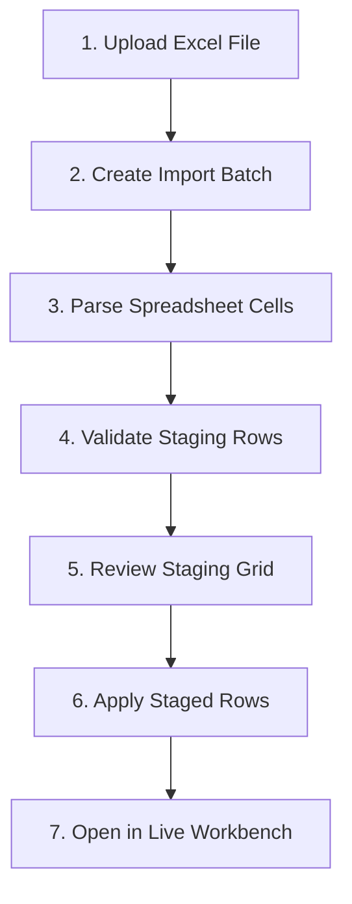

# Excel Import Staging Contract

- **Status**: Authoritative API & Domain Contract
- **Sprint Target**: S12-PR-001

---

## 1. Purpose
This document establishes the architecture, lifecycle, and staging boundary for importing asset lists from Excel spreadsheets into Project Valora. It ensures that uploaded records are staged, mapped, and validated within a secure environment before they can be promoted to the official valuation master records.

## 2. Relationship to Authoritative Contracts
- **Relationship to Design Book v1.3**: Implements the staging boundary of the Excel Import Pipeline module. Aligns with the Non-IT UX registry to present clear validation errors. Enforces AI-assistance guardrails (AI cannot auto-approve or auto-import).
- **Relationship to Sprint 11 Live Workbench Loop**: Staged records do not appear in the Live Workbench grid. Staged data remains in a separate sandbox layer. A separate, future "Apply" action will copy valid staging lines to the official `ProjectAssetLine` table, which the Workbench then loads.
- **Relationship to Vietnamese i18n Dictionary**: Keys for validation results and import status tags are translated to user-friendly Vietnamese labels (e.g., `Đang chờ kiểm tra`, `Hợp lệ`, `Không hợp lệ`, `Có cảnh báo`).

## 3. Import Lifecycle
The import process is structured across the following stages:



*Note: S12-PR-001 implements step 2 and defines the structures for steps 3 and 4. Actual parsing, file upload streams, and the apply-to-workbench action (steps 5-7) are deferred to subsequent PRs.*

## 4. Staging vs. Official Data Boundary
Under no circumstances do import staging rows write to, mutate, or affect the official `ProjectAssetLine` table. 
- **Read Isolation**: Staged rows are stored in the `project_asset_import_staging_rows` table. They are completely excluded from the `/api/v1/projects/{project_id}/asset-lines` endpoint.
- **Write Isolation**: Staging data is read-only for standard valuation calculations. It exists solely to allow mapping corrections and validation review by users.

## 5. Excel Source Handling & Raw Value Preservation
- **Treat Cells as Values**: All cells are treated as raw string values. Formulating or running Excel macro logic is forbidden.
- **Traceability**: The database keeps a copy of the raw cell values originally retrieved from the spreadsheet column positions in the `raw_values` JSON dictionary. This ensures complete auditability and error diagnostic capabilities.
- **No Absolute Path Exposure**: File path mappings on the server are masked. The batch stores only the user-visible filename (e.g., `assets.xlsx`) to prevent directory traversal or internal path leakage.

## 6. Column Mapping Assumptions
During ingestion, the parser maps spreadsheet columns to staging row target fields:
- `asset_name` -> `proposed_asset_name`
- `description` -> `proposed_description`
- `quantity` -> `proposed_quantity`
- `unit` -> `proposed_unit`
- `raw_price` -> `proposed_raw_price`
- `currency` -> `proposed_currency`

These mapped properties are validated prior to being applied to official tables.

## 7. Validation Status Model
Staged rows are assigned one of four validation statuses:
- **`pending`** (`Đang chờ kiểm tra`): The row has been parsed but validation rules have not run yet.
- **`valid`** (`Hợp lệ`): The row has passed all schema checks and is ready to be applied.
- **`warning`** (`Có cảnh báo`): The row has minor validation discrepancies but can be applied (with warnings noted).
- **`invalid`** (`Không hợp lệ`): The row contains severe validation errors (e.g. invalid quantity format, missing asset name) and cannot be applied until corrected.

## 8. Error Behavior & Non-IT Shielding
- Parser exceptions or data type mismatches are converted into clean, business-friendly errors stored in the `validation_errors` JSON array.
- Technical details such as ORM constraint names, SQL trace dumps, or parser library exception traces are kept on the server and never exposed in the API.

## 9. RBAC & Multi-Tenant Scoping
- **Multi-Tenant Scoping**: All routes enforce active `organization_id` verification. Users cannot create, retrieve, or query batches and staging rows associated with projects belonging to another tenant organization.
- **Permissions**:
  - `POST /api/v1/projects/{project_id}/asset-imports`: Requires `workbench:edit` (as this prepares data modification).
  - `GET /api/v1/projects/{project_id}/asset-imports`: Requires `project:read`.
  - `GET /api/v1/projects/{project_id}/asset-imports/{batch_id}/rows`: Requires `project:read`.

## 10. AI Guardrails
AI integration is strictly advisory. AI cannot auto-map, auto-approve, or auto-apply import staging rows. All final mappings and promotion to official records require explicit human confirmation.

## 11. API Route Contract

### A. Create Import Batch Metadata
- **Route**: `POST /api/v1/projects/{project_id}/asset-imports`
- **Permission**: `workbench:edit`
- **Request Body**:
  ```json
  {
    "source_filename": "assets.xlsx",
    "source_sheet_name": "Sheet1"
  }
  ```
- **Response Shape**:
  ```json
  {
    "id": "uuid-string",
    "project_id": "uuid-string",
    "status": "created",
    "source_filename": "assets.xlsx",
    "source_sheet_name": "Sheet1",
    "total_rows": 0,
    "valid_rows": 0,
    "invalid_rows": 0,
    "warning_rows": 0,
    "created_at": "iso-datetime",
    "updated_at": "iso-datetime"
  }
  ```

### B. List Import Batches
- **Route**: `GET /api/v1/projects/{project_id}/asset-imports`
- **Permission**: `project:read`
- **Response Shape**:
  ```json
  [
    {
      "id": "uuid-string",
      "project_id": "uuid-string",
      "status": "ready_for_review",
      "source_filename": "assets.xlsx",
      "source_sheet_name": "Sheet1",
      "total_rows": 120,
      "valid_rows": 98,
      "invalid_rows": 12,
      "warning_rows": 10,
      "created_at": "iso-datetime"
    }
  ]
  ```

### C. List Staging Rows
- **Route**: `GET /api/v1/projects/{project_id}/asset-imports/{batch_id}/rows`
- **Permission**: `project:read`
- **Query Params**:
  - `limit` (default 50)
  - `offset` (default 0)
  - `validation_status` (optional: pending | valid | invalid | warning)
- **Response Shape**:
  ```json
  {
    "project_id": "uuid-string",
    "import_batch_id": "uuid-string",
    "items": [
      {
        "id": "uuid-string",
        "import_batch_id": "uuid-string",
        "source_row_number": 12,
        "proposed_asset_name": "Máy xúc Komatsu PC200",
        "proposed_quantity": "1",
        "proposed_unit": "cái",
        "proposed_raw_price": "100000000",
        "proposed_currency": "VND",
        "validation_status": "warning",
        "validation_errors": [],
        "validation_warnings": [
          {
            "field": "year",
            "message_key": "excel.validation.year_missing"
          }
        ]
      }
    ],
    "total": 1,
    "limit": 50,
    "offset": 0
  }
  ```

---

## 12. S12-PR-002: Excel File Upload & Parser Intake
To enable ingestion of Excel spreadsheets into the staging model, the following specifications are implemented:

- **Route**: `POST /api/v1/projects/{project_id}/asset-imports/{batch_id}/upload`
- **Request Format**: `multipart/form-data` with form field `file`
- **Permission**: `workbench:edit`
- **Accepted File Type**: `.xlsx` only. Content verification processes file headers and extension type; invalid formats trigger a friendly Vietnamese error.
- **Value-Only Parsing**: `openpyxl` is loaded in read-only mode with `data_only=True` to extract cell values and cached evaluations. Execution of formulas, macros, VBA scripts, or external workbook links is strictly disabled.
- **Header Normalization**: Columns are trimmed, converted to lowercase, and normalized using underscores (e.g. `Tên tài sản` -> `ten_tai_san` / `tên_tài_sản`).
- **Deterministic Column Mapping**: 
  - `proposed_asset_name` maps `asset_name`, `ten_tai_san`, `tên_tài_sản`, `name`
  - `proposed_description` maps `description`, `mo_ta`, `mô_tả`, `specification`, `thong_so`, `thông_số`
  - `proposed_quantity` maps `quantity`, `so_luong`, `số_lượng`, `qty`
  - `proposed_unit` maps `unit`, `don_vi`, `đơn_vị`
  - `proposed_raw_price` maps `raw_price`, `gia_goc`, `giá_gốc`, `cost`, `price`
  - `proposed_currency` maps `currency`, `tien_te`, `tiền_tệ`
- **Staging Row Creation**: Parsed rows create isolated `ProjectAssetImportStagingRow` entries defaulting to `pending` validation state. Fully empty sheet lines are skipped. Absolute row count limit is capped at 5,000 rows.
- **Batch Counters**: The upload endpoint returns the updated `ProjectAssetImportBatchResponse` with modified `status` (`parsed`) and updated `total_rows`.
- **Immutability**: Staging ingestion remains decoupled from official data. No mutations occur on the `ProjectAssetLine` table.

## 13. S12-R-006: Hardened Security, Limits, and Concurrency Policies
To protect against system degradation, Denial of Service (DoS), data inconsistency, and race conditions, the following strict intake policies are enforced:

### A. HTTP Request-Size Validation
- Enforces strict Content-Length checks at the boundary of request validation.
- Missing headers default to safe streaming up to a strict 10 MiB file size limit.
- Negative or malformed Content-Length values are immediately rejected with an HTTP 400 response.
- Content-Length values exceeding 12 MiB (12,582,912 bytes) are rejected immediately with an HTTP 413 response.
- Enforces an actual file size cap of 10 MiB (10,485,760 bytes) and a spool-to-disk threshold of 1 MiB (1,048,576 bytes).

### B. ZIP Archive Security and Expansion Limits
- ZIP entries are capped at 2,048 members.
- Total uncompressed ZIP expansion size is capped at 100 MiB.
- Attempts to upload encrypted archives, external links, macro/VBA parts, or unsafe directory paths (`..`, absolute paths) are blocked with a friendly Vietnamese validation error.

### C. Spreadsheet Row, Column, and Character Limits
- Capped at exactly 100 columns. Any sheet containing 101 or more columns is rejected.
- Capped at exactly 5,000 data rows. Any sheet containing 5,001 or more data rows is rejected.
- Capped at a maximum physical row limit of 5,100 rows.
- Capped at 10,000 characters per cell.
- Capped at 100,000 characters per row.
- The parser scans for headers up to a maximum of 100 rows. Genuinely blank rows preceding the header row are skipped and do not count toward data rows, but the header row must reside within the first 100 physical rows.

### D. Transaction Safety and Concurrency Control
- **Pessimistic Concurrency**: Acquires a pessimistic row-level write lock (`SELECT ... FOR UPDATE`) on the `ProjectAssetImportBatch` record immediately when the upload begins.
- **Separate-Session Semantics**: Concurrency is managed in isolated database sessions to guarantee serializable transaction behavior.
- **Transactional Savepoint Atomicity**: All spreadsheet parsing and staging row replacements run within a nested transaction savepoint (`db.begin_nested()`). Any validation limit breach or runtime exception rolls back all modifications to this savepoint, leaving previously imported staging rows intact.
- **Audit Event Persistence & Serialization**: Both upload success and parser failure audit events are persisted atomically to the database. Failure logs include the exception code and previous staging row count. Stale failures from older concurrent generation processes are prevented from overwriting newer successfully parsed states.
- **Official Data Immutability**: All existing `ProjectAssetLine` records, their IDs, quantities, names, and version fields remain strictly immutable throughout the Excel ingestion transaction. Any transaction fault or outer commit failure rollback guarantees that no partial changes or draft states leak to ProjectAssetLine.


