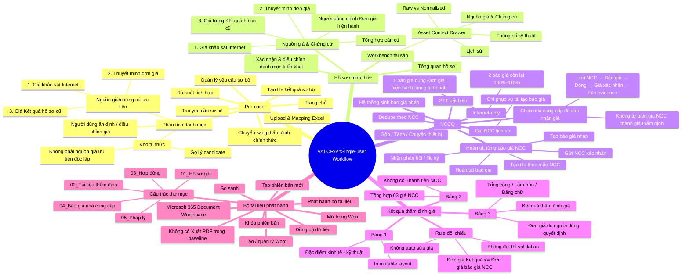

# VALORA v2.3 — User Flow Mindmap

**Trạng thái:** `DESIGN SUPPORT / FLOW MAP`  
**Authority:** Bám theo handoff v2.3 + các addendum mới nhất. Nếu mâu thuẫn, business/design authority mới nhất thắng.



## Semantic giá

```text
Nguồn ưu tiên xác định giá:
Giá khảo sát Internet
→ Thuyết minh đơn giá
→ Giá trong phần Kết quả của hồ sơ cũ
→ Người dùng quyết định Đơn giá hiện hành / Đơn giá Kết quả

Luồng báo giá NCC:
Đơn giá hiện hành
→ Giá đề nghị
→ NCC xác nhận
→ Đơn giá NCC đã xác nhận
→ Dùng làm báo giá/evidence đối chiếu

Rule kết quả:
Đơn giá Kết quả định giá <= Đơn giá báo giá NCC dùng để đối chiếu
```

## Guardrail

- `Kho tri thức` chỉ gợi ý; không tự ra quyết định giá.
- Giá NCC không phải nguồn chính để xác định Đơn giá thẩm định cuối cùng.
- Giá NCC lịch sử phục vụ tái tạo báo giá và lineage.
- Người dùng kiểm soát `Đơn giá hiện hành`; mọi thay đổi có history/lineage/audit.
- Không có S14 xác nhận lại giá, màn Kiểm tra hồ sơ riêng hoặc workflow KSCL riêng.
- Không có NCCQ aggregate trung gian sau khi chọn NCC đã xác nhận giá.
- Ba bảng Kết quả thẩm định giá là immutable layout.
- Microsoft 365 quản lý file/version/Word; VALORA quản lý structured business data, snapshot, lineage và audit.