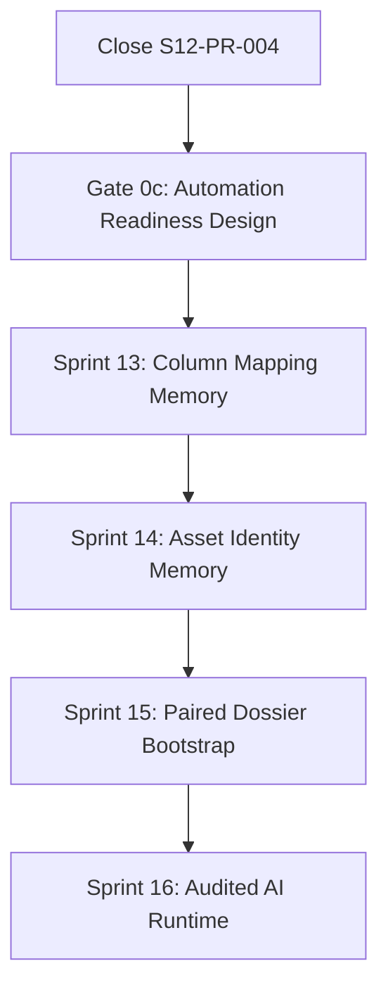

# S13–S16 Adaptive Intake, Knowledge Memory and Historical Dossier Remediation Plan

**Status:** Active implementation plan after S12-PR-004 engineering closure and S13-PR-001 design-authority merge; runtime tasks remain individually gated.
**Design authority:** Design Book v1.4 adaptive-intake/bounded-automation addendum + ADR 0030–0034 + Design Authority Index.
**Accepted main baseline evidence (not evergreen):** S13-PR-003 squash `2af753520ab6b7885555adc5b7945a28d32ee311` (PR #17); post-merge main CI `29676915010` PASS. Prior S13-PR-002: `137f8c5…` / CI `29641452155`.
**Gate 0 (S12 engineering closure):** **satisfied**.
**Gate 0b (S13-PR-001 documentation gate):** **satisfied**.
**Gate 0c (bounded-AI automation readiness):** **satisfied** (main `99dfccbc7bf2893fa5b0dce8d52a01068655e39a`; CI `29504915362` PASS).
**Runtime assignment state:** **S13-PR-004** assigned with branch name `s13-pr-004-column-mapping-memory` from accepted main `2af753520ab6b7885555adc5b7945a28d32ee311`; freeze its design/evidence gate before runtime.
**Rule:** S13-PR-002 and S13-PR-003 are merged / closed. S13-PR-004 alone is owner-authorized. Do not start S13-PR-005+ without a separate explicit owner assignment. Branch runtime from the assigned accepted `origin/main` only.

---

## 1. Goal

Close the verified gaps that prevent Valora from:

- reading real customer `.xls`/`.xlsx` workbooks with variable structures;
- asking non-IT users to confirm ambiguous columns;
- remembering confirmed column mappings by customer/template;
- preserving and matching customer raw asset wording;
- ingesting historical Excel–Word dossiers as supervised knowledge sources;
- extracting and aligning technical, quote and final-result tables;
- learning safely from human decisions;
- running audited AI column/identity suggestions end to end;
- preserving provider-independent AI task/context/decision provenance;
- preparing a deny-by-default, risk-tiered extension point for future bounded automation;
- running long-lived AI/extraction tasks through reliable idempotent jobs.

The target remains human-controlled. No task below authorizes AI auto-approval, AI auto-Apply or direct active-knowledge injection.

---

## 2. Verified gap register

| ID | Current gap | Current evidence | Target owner |
| --- | --- | --- | --- |
| G-01 | Parser accepts `.xlsx` only | `excel_import/domain/ACCEPTED_EXTENSIONS` | Sprint 13 workbook adapter |
| G-02 | First non-empty row becomes header | `_LazyWorkbook._find_headers()` | Sprint 13 structure discovery |
| G-03 | Fixed aliases miss real headers/blank I | `COLUMN_ALIASES`, `_map_columns()` | Sprint 13 Column Mapping Memory |
| G-04 | No section/subtotal/total classification | parser emits each non-empty row | Sprint 13 row classifier |
| G-05 | No mapping-confirmation screen | no adaptive mapping UI/API | Sprint 13 UX |
| G-06 | No `ColumnMappingProfile` | no persistence/API | Sprint 13 memory persistence |
| G-07 | No Excel–Word dossier aggregate | no DossierBundle | Sprint 15 dossier aggregate |
| G-08 | No multi-table row alignment | no alignment model/service | Sprint 15 alignment |
| G-09 | No real Word extraction runtime | generic models/CRUD only | Sprint 15 Document Intelligence runtime |
| G-10 | No feedback contract | no confirmed-decision learning events | Sprint 14 feedback |
| G-11 | No end-to-end AI column/asset matcher | AI module boundary only | Sprint 16 AI Gateway/tasks |
| G-12 | No AI task/context/attempt provenance | generic audit cannot reproduce a bounded task run | Sprint 16 reliable AI task runtime |
| G-13 | No deterministic Execution Policy/capability release | no central risk/promotion/kill-switch decision | Sprint 16 policy foundation; no R2 promotion in this plan |
| G-14 | Worker has no durable business jobs/outbox | worker remains Sprint 0 skeleton | Sprint 15 reliable job foundation before document extraction |

---

## 3. Global gates and ordering



### Gate 0 — S12 engineering closure (satisfied)

Evidence:

- S12-PR-004 squash-merged to `main` at `a9f2c1e77e3ec46f216b881d608a02685b9d322a` (PR #10);
- post-merge main CI `29419008129` PASS;
- M2 + seven concurrency nodes executed with zero target skips;
- independent post-CI audit PASS on pre-merge head `64086dd…`.

### Gate 0b — S13-PR-001 documentation gate (satisfied)

Evidence:

- independent design audit PASS (corrective re-audit on head `4b2422e…`);
- owner Ready/squash/merge of S13-PR-001 as PR #11;
- main SHA `7f7473e459f592deac1054be3935d7f911b760a2`;
- post-merge main CI `29429680504` PASS;
- no Adaptive Intake runtime mixed into the design-authority package.

S13-PR-002 was the next runtime candidate after Gate 0b; owner assignment was issued separately on 2026-07-16.

### Gate 0c — bounded-AI automation readiness (satisfied)

Evidence:

- Design Book v1.4 §20 and ADR 0033–0034 merged as accepted authority (PR #13);
- independent design audit PASS on head `656dc9ff70a453ee5b83f47d13b7040b3f062076`;
- owner Ready/squash/merge of Gate 0c as PR #13 at main `99dfccbc7bf2893fa5b0dce8d52a01068655e39a`;
- post-merge main CI `29504915362` PASS (backend/frontend/worker);
- no Adaptive Intake runtime, provider calls, or R2 capability mixed into the design package.

S13-PR-002 was subsequently owner-authorized as the first Adaptive Intake runtime task and later
merged / closed at main `137f8c527422b656974e569c924dafa8150b8b22`.

### Post-merge live-gate reconciliation provenance

After Gate 0c merged and main CI passed, live operating documents were reconciled so they no longer
describe Gate 0c as pending. That reconciliation is **provenance only** (not a durable live task).
Durable state after closeout main: Gate 0c closed/satisfied; S13-PR-002/003 merged / closed;
S13-PR-004 owner-assigned design-first from accepted main `2af7535…`.

### Gate 1 — deterministic baseline before external AI

Workbook discovery, mapping profiles, deterministic identity retrieval and DOCX extraction must work without Gemini/DeepSeek. Sprint 16 augments, not replaces, those paths.

### Gate 2 — source and review before knowledge activation

No historical bootstrap activation until source locators, alignment review and candidate lineage are complete.

### Gate 3 — reliable jobs before long-running extraction or AI

The durable outbox/job/attempt boundary must exist before production DOCX/PDF/OCR extraction or external AI tasks run asynchronously. S15 document extraction and S16 AI tasks reuse one job contract rather than inventing separate queues.

---

## 4. Sprint 13 — Adaptive Intake and Column Mapping Memory

### S13-PR-001 — Design Authority and Contract Reconciliation

**Type:** docs-only.
**Status:** **merged / closed** (PR #11 squash `7f7473e…`; main CI `29429680504` PASS).
**Scope delivered:** Design Book v1.4, ADR 0030–0032, Authority Index, contract/handoff/CODEX/guardrails reconciliation, this plan.
**Not implemented by S13-PR-001:** runtime code, migrations, dependencies, AI calls.
**Does not authorize by itself:** S13-PR-002 or any S13 runtime work (runtime still needed separate assignment — later issued for S13-PR-002 only).

### Post-merge live-gate reconciliation provenance

After S13-PR-001 merged, live operating documents were reconciled so they no longer
describe S13-PR-001 as an active docs gate. That reconciliation is **provenance only**
(not a durable live task). Durable historical state after design gates: S13-PR-001 closed, Gate 0b/0c satisfied.
Current live state: S13-PR-002 and S13-PR-003 are merged / closed; S13-PR-004 is assigned design-first.

### S13-PR-002 — Legacy Workbook Adapter and Immutable Source Artifact

**Status:** **merged / closed** (PR #15 squash `137f8c527422b656974e569c924dafa8150b8b22`; post-merge CI `29641452155` PASS).
**Closes:** G-01 and the source-replay prerequisite.

Scope:

- neutral `WorkbookAdapter` contract;
- safe `.xlsx` adapter extraction behind the contract;
- safe `.xls` adapter following dependency/security spike;
- immutable source artifact/checksum/storage metadata;
- server-owned storage-object identity and checksum verification;
- explicit pending/available/failed/orphaned source states or equivalent recoverable protocol;
- bounded reconciliation/cleanup for database/object-storage partial failures;
- value-only behavior, no macro/formula/external execution;
- bounded resource/security limits for both formats;
- friendly Vietnamese format/security errors.

Required tests:

- valid `.xls` and `.xlsx` fixtures;
- malformed/encrypted/macro/external-link rejection as applicable;
- max file/row/column/cell boundaries;
- duplicate and blank header preservation;
- source checksum and prior-generation preservation on failure;
- object-write/database-commit and database-reservation/object-write failure recovery;
- orphan cleanup never removes a referenced or prior reviewed artifact;
- no `ProjectAssetLine` mutation.

Non-goals:

- no semantic mapping;
- no new identity logic;
- no Office desktop automation.

### S13-PR-003 — Workbook Structure Discovery and Row Classification

**Status:** **merged / closed** (PR #17 squash `2af753520ab6b7885555adc5b7945a28d32ee311`; post-merge CI `29676915010` PASS).
**Closes:** G-02 and G-04.

Scope:

- rank candidate sheets/table regions/header spans;
- support title rows and multi-row headers;
- classify `asset/section/subtotal/total/note/empty/unresolved`;
- persist/version structure snapshot and rule version;
- expose explanations and candidate confidence;
- fail to review instead of silently choosing ambiguous regions.

Required tests:

- PD-001 selects/proposes sheet `PD-001` and header row 5;
- A1 title is not accepted as the table header;
- `PHẦN ĐIỆN` and `PHẦN NƯỚC` are sections;
- total/subtotal/note rows are not materialized as assets;
- inserted/reordered title/header rows create review rather than silent drift;
- deterministic replay from the same structure snapshot.

### S13-PR-004 — Column Mapping Memory Persistence and Application Services

**Status:** **owner-assigned, design-first** with assigned branch name `s13-pr-004-column-mapping-memory` from baseline `2af753520ab6b7885555adc5b7945a28d32ee311`.
**Closes:** G-03 and G-06.

Scope:

- migrations/models for source snapshot, profile, fields, decision and usage;
- semantic role registry;
- customer/template fingerprinting;
- profile versions and supersession;
- proposal/confirm/reject application services;
- ADR 0033-compatible proposal source, version, before/after decision summary and committed-outcome linkage;
- exact mapping snapshot per import batch;
- materialize staging only from confirmed mapping;
- tenant/RBAC/audit contracts.

Required tests:

- map `TÊN VẬT TƯ`, `KHỐI LƯỢNG`, `GIÁ TĐ` by semantics;
- permit blank-header I to be confirmed as `evidence_note`;
- same customer/template retrieves the active profile;
- moved columns produce the correct new snapshot/profile version;
- duplicate/conflicting profile requires review;
- cross-tenant profile access fails closed;
- correcting a profile never rewrites prior batch mapping;
- no AI/rule proposal materializes staging without confirmation.

### S13-PR-005 — Mapping Confirmation API and Astryx Vietnamese UX

**Closes:** G-05.

Scope:

- analysis/proposal/read/confirm API adapters;
- step **Xác nhận cấu trúc file**;
- sheet/header/table preview;
- role selectors and blank-header rendering;
- row-type preview and warnings;
- `Ghi nhớ cấu trúc này cho khách hàng`;
- optimistic version/double-submit protection;
- Vietnamese i18n and friendly errors;
- Astryx-only patterns.

Required tests:

- non-IT happy path from upload to confirmed staging;
- required-role missing/duplicate conflicts;
- stale profile/decision response;
- loading/error/empty states;
- keyboard/accessibility and layout tests as supported;
- frontend cannot bypass server confirmation.

### Sprint 13 completion gate

- both formats accepted safely;
- sample structure/roles/row classes pass;
- profile reuse/versioning works;
- mapping UI is human-confirmed and Vietnamese-first;
- existing S12 validation/Apply invariants are preserved;
- PostgreSQL migration/tenant/concurrency tests pass.

---

## 5. Sprint 14 — Raw Asset Observation and Asset Identity Memory

### S14-PR-001 — Raw Asset Observation and Contextual Alias Persistence

**Closes:** the data foundation for G-10/G-11.

Scope:

- `RawAssetObservation` persistence and immutable source locator;
- link to staging/import and optional project/dossier contexts;
- `ContextualAssetAlias` organization/customer scope;
- status/version/source-decision lineage;
- compatible relationship to CanonicalAsset/AssetVariant;
- migration/backfill policy for current imported project lines.

Required tests:

- raw wording/unit/quantity remain unchanged after identity decisions;
- customer-specific alias scope;
- curated AssetAlias remains distinct;
- merge/deprecate preserves alias/decision lineage;
- cross-tenant reads/writes fail closed.

### S14-PR-002 — Deterministic Explainable Asset Matcher

Scope:

- normalization and attribute extraction baseline;
- layered candidate retrieval;
- contextual alias/customer precedent;
- canonical/variant/code/fuzzy/attribute scoring;
- top-k and score breakdown;
- close-candidate/conflicting-attribute detection;
- derived/rebuildable match index;
- price excluded as a primary identity key.

Required tests:

- exact contextual/curated alias precedence;
- model/brand/attribute match and conflict cases;
- local wording and mixed name/spec examples from PD-001;
- deterministic score version/replay;
- recall@k benchmark fixture;
- no official write from candidate generation.

### S14-PR-003 — Identity Review, Decision and Feedback Contract

**Closes:** G-10.

Scope:

- append-only accepted/corrected/rejected/deferred decisions;
- positive/negative `LearningFeedbackEvent` semantics;
- `DecisionEpisode` linkage without duplicating the authoritative identity decision;
- approved contextual alias creation/promotion path;
- high-confidence explicit batch review, never auto-approval;
- UI step **Đối chiếu tài sản** using Astryx/Vietnamese;
- raw/candidate/difference/source views;
- top-k selection, create variant/new asset/defer actions.

Required tests:

- only committed human decisions become feedback;
- temporary/failed/rolled-back/auto-rejected candidates do not become positive examples;
- rejected candidate reason persists;
- duplicate submit and stale review protection;
- no automatic active CanonicalAsset/Alias/KnowledgeVersion;
- audit actor/time/version completeness.

### Sprint 14 completion gate

- raw observations and contextual aliases are first class;
- deterministic matcher has measurable recall@k and explanations;
- all identity outcomes are human-reviewed and append-only;
- next Excel-only import can reuse reviewed history without AI.

---

## 6. Sprint 15 — Paired Dossier, Word Runtime and Historical Bootstrap

### S15-PR-001 — DossierBundle and Source File Roles

**Closes:** G-07.

Scope:

- DossierBundle aggregate and lifecycle;
- source file roles/checksums/access policy;
- bootstrap batch identity/idempotency;
- organization/customer/report/valuation metadata;
- link to existing Project only when real, not manufactured.

Required tests:

- pair Excel + Word in one bundle;
- required/duplicate role rules;
- source immutability/checksum;
- rerun idempotency;
- tenant and evidence-access security.

### S15-PR-002 — Reliable Task Job and Outbox Foundation

**Closes:** G-14 and satisfies Gate 3 for document extraction.

Scope:

- transactional outbox and durable task/job/attempt persistence;
- server-derived tenant/initiator/correlation/causation metadata;
- idempotency key and duplicate-delivery protection;
- lease/claim with expiry and safe reclaim;
- bounded retry/backoff, timeout and cancellation;
- dead-letter/exception-review state;
- generation token and stale-result rejection;
- database/object-storage partial-failure and orphan reconciliation;
- restricted operational audit without source contents.

Required tests:

- committed outbox request is eventually claimable;
- duplicate delivery cannot duplicate a domain result;
- expired lease can be safely reclaimed;
- timeout/cancel/retry terminal states are deterministic;
- stale generation cannot overwrite a newer reviewed generation;
- object/database half-write reaches a recoverable state;
- cross-tenant job/attempt access fails closed.

Non-goals:

- no AI provider or prompt runtime;
- no domain-specific extraction logic;
- no autonomous capability promotion.

### S15-PR-003 — DOCX Extraction Runtime and Table Role Candidates

**Closes:** G-09.

Scope:

- deterministic DOCX paragraphs/tables/layout extraction;
- ExtractedTable/Row persistence missing from runtime code;
- metadata extraction for report number/date/valuation time/customer;
- candidate roles for technical/comparison/final tables;
- source table/row/cell locator;
- execute through the S15-PR-002 durable job/attempt boundary;
- retry/version/failure behavior;
- bounded PDF/OCR extension contract, not necessarily full OCR in this PR.

Required tests:

- PD-001 extracts report metadata;
- 49 technical rows;
- 3 suppliers × 49 = 147 quote observations;
- 49 final-result rows;
- source locators and extraction version;
- parser failure preserves prior reviewed extraction;
- no official mutation.

### S15-PR-004 — Multi-Table Dossier Row Alignment and Review UX

**Closes:** G-08.

Scope:

- `DossierRowAlignment` model/service;
- STT/section/order/name/unit/quantity/attribute scoring;
- missing/inserted/split/merged/reordered row handling;
- conflict explanations;
- review/confirm/reject/unresolved workflow;
- Astryx/Vietnamese alignment review.

Required tests:

- 49 sample alignments are proposed/reviewable;
- order-only matching is rejected as sole authority;
- `Km` vs `Mét` is flagged;
- epoxy rounding is recorded as transformation;
- five materially changed names remain linked raw-to-standardized;
- removed/reordered synthetic rows create conflicts, not drift.

### S15-PR-005 — Reviewed Historical Bootstrap Candidate Import

Scope:

- produce identity/contextual-alias/spec/quote/decision/knowledge candidates;
- price-proposal vs QuoteLine vs final-decision separation;
- raw evidence-note observation and typed-resolution candidate;
- human promotion commands;
- batch metrics, reconciliation and deactivation/rollback;
- pilot with 5–10 diverse dossiers before 20–50 corpus expansion.

Required tests:

- no direct active-knowledge SQL injection;
- full source lineage for every promoted candidate;
- quote supplier/time/evidence completeness;
- rerun does not duplicate candidates/knowledge;
- rollback/deactivation retains source and audit;
- reconciliation counts match source/alignment/promoted outputs.

### Sprint 15 completion gate

- historical dossier is a real aggregate;
- reliable outbox/job/attempt runtime is operational before extraction;
- Word extraction and alignment run end to end;
- bootstrap creates reviewed candidates with full lineage;
- sample and adversarial row-drift fixtures pass;
- pilot data can seed both memories safely.

---

## 7. Sprint 16 — Reliable, Audited AI Suggestion Runtime

### S16-PR-001 — Audited AI Task, Context and Policy Foundation

**Closes:** G-12; establishes the non-promoted foundation for G-13 and reuses the S15 reliable job contract.

Scope:

- registered typed task-contract interface;
- `AITaskRun`, append-only `AITaskAttempt` and restricted `AIContextManifest` persistence;
- distinct human/system/AI-service principal provenance;
- `ActionProposal` and deny-by-default `ExecutionPolicy` interface;
- current policy outcomes limited to read/suggest/human-review/blocked;
- bind each `AITaskRun`/attempt to the existing durable job/outbox runtime;
- AI-specific timeout/cost/rate/error outcome mapping without creating a second queue;
- correlation/causation and restricted operational audit.

Required tests:

- duplicate/retried job execution cannot duplicate an AI run or domain outcome;
- stale/cancelled AI result cannot become a proposal for a newer generation;
- cross-tenant context/job/run access fails closed;
- raw sensitive context is absent from general audit payloads;
- policy defaults to human review/blocked for every write-capable proposal.

### S16-PR-002 — Provider Gateway and Task Registry

Scope:

- backend-only Gemini, DeepSeek and deterministic/mock provider interfaces;
- versioned prompt/task/input/output registry;
- centralized tenant/data-policy context assembler;
- schema validation before and after provider calls;
- timeout/rate/cost/error handling recorded per attempt;
- task-specific evaluated fallback allowlist;
- deterministic/manual fallback when provider execution is unavailable or unapproved;
- no provider credentials or provider naming in frontend/general logs.

Required tests:

- provider attempt/version/cost/latency provenance;
- malformed provider output fails schema validation;
- unregistered task/model/fallback is rejected;
- data classification/redaction policy is applied before request;
- provider failure preserves deterministic/manual operation.

### S16-PR-003 — AI Column Mapping Suggestion Task

**Partially closes:** G-11.

- implement `AI-TASK-COLUMN-MAPPING-SUGGEST`;
- schema-validate role/row candidates;
- combine with deterministic proposal;
- expose reasons, source references and task/model/prompt version;
- link human outcome through ADR 0033 Decision Episode semantics;
- mandatory mapping review;
- no auto-materialization or profile activation;
- fallback to deterministic/manual flow on AI failure.

### S16-PR-004 — AI Asset Identity Rerank Task

**Closes:** remaining G-11 scope.

- extend `AI-TASK-ASSET-IDENTITY-SUGGEST` over deterministic top-k;
- never allow AI to invent unreferenced active assets/evidence;
- show reason/difference/conflict explanations and source references;
- link human outcome through ADR 0033 Decision Episode semantics;
- mandatory identity review;
- fallback to deterministic matcher.

### S16-PR-005 — End-to-End Shadow Evaluation and Release Gate

- versioned 20–50 dossier corpus with dossier/customer/time leakage controls;
- compare deterministic baseline, AI-assisted proposal and independent human outcome;
- run shadow mode without write side effects;
- measure mapping accuracy, alignment accuracy, recall@k, false high-confidence, correction rate, review time, latency and cost;
- evaluate every permitted provider fallback separately;
- deploy suggestion capabilities only if agreed thresholds pass;
- rollback task/prompt/provider/model/retriever version;
- no online per-click training;
- no `auto_draft`, `auto_stage` or `exception_only_review` promotion in this release.

### Sprint 16 completion gate

- durable task/context/attempt/job provenance works end to end;
- AI tasks work through the audited provider gateway and task registry;
- deterministic/manual fallback remains complete;
- ExecutionPolicy remains deny-by-default and no R2 capability is promoted;
- AI cannot auto-confirm, auto-Apply, mutate official data or activate knowledge;
- evaluation shows measurable benefit without unacceptable high-confidence errors.

---

## 8. Cross-cutting data and migration rules

- Every migration states tenant scope, indexes, delete behavior and downgrade/rollback limits.
- Source artifacts, raw observations, decisions and reviewed extraction use RESTRICT/immutability semantics appropriate to audit lineage.
- Existing S12 batches/rows remain readable; do not retroactively infer confirmed profiles.
- Backfill creates `unknown_legacy_mapping` metadata where exact prior mapping decisions do not exist.
- Derived fingerprints/indexes may be rebuilt; they are not source-of-truth records.
- Active/canonical records are never seeded by migration scripts.
- Pilot/import data uses application commands and batch idempotency keys.
- Domain decisions store ADR 0033-compatible proposal/outcome/version metadata from their first implementation; missing legacy provenance stays explicitly unknown.
- Derived Workflow Pattern candidates use domain commands/Decision Episodes, not UI clickstream.
- Any future AI-triggerable write path must be allowlisted, idempotent and atomic with required audit before policy registration.

---

## 9. Security and privacy gates

Every code PR must prove:

- server-derived actor/organization/customer/project/bundle scope;
- no cross-tenant profile, alias, observation, dossier or AI-context access;
- no raw file/cell payloads in general audit logs;
- no formula/macro/external execution;
- no provider secret exposure;
- no unrestricted context sent to AI;
- no client/provider asserted human actor or approval;
- no provider/prompt/frontend direct database mutation;
- no unregistered provider fallback or task/tool access;
- no durable job without tenant scope, idempotency and stale-generation protection;
- fail-closed behavior on unknown/ambiguous targets;
- immutable evidence/source lineage.

---

## 10. UX gates

- Vietnamese labels are externalized in i18n.
- Astryx components/tokens only unless separately approved.
- Non-IT users see business language and corrective actions, not HTTP/SQL/model internals.
- Mapping and identity review show source data, proposal, differences and explicit confirm/reject actions.
- Confidence color alone is insufficient; text labels and reasons are required.
- Empty/loading/error/stale/double-submit states are specified and tested.

---

## 11. Quality dashboard

Track by adapter/rule/profile/model version:

```text
sheet and header discovery accuracy
column-role accuracy and correction rate
row-classification accuracy
profile reuse and conflict rate
raw locator completeness
identity recall@k and top-1 acceptance
false high-confidence identity rate
dossier extraction/table-role accuracy
row-alignment accuracy
quote supplier/time/evidence completeness
review time and deferred rate
reuse accuracy on subsequent imports
shadow disagreement and correction rate
task latency/cost/error/fallback by contract version
policy review/block reason rate
stale-result and duplicate-delivery rejection rate
```

No confidence threshold is production-frozen from the single PD-001 dossier.

---

## 12. Definition of completion for the remediation program

The program is complete only when all G-01…G-14 are closed by code, tests and audit; Design Book/ADR/handoff truth matches the merged main; the deterministic/manual path works without AI; the paired-dossier bootstrap has reviewed pilot evidence; reliable AI tasks have shadow/evaluation proof; no R2 capability is silently promoted; and no unresolved blocker is hidden behind a PASS label.
