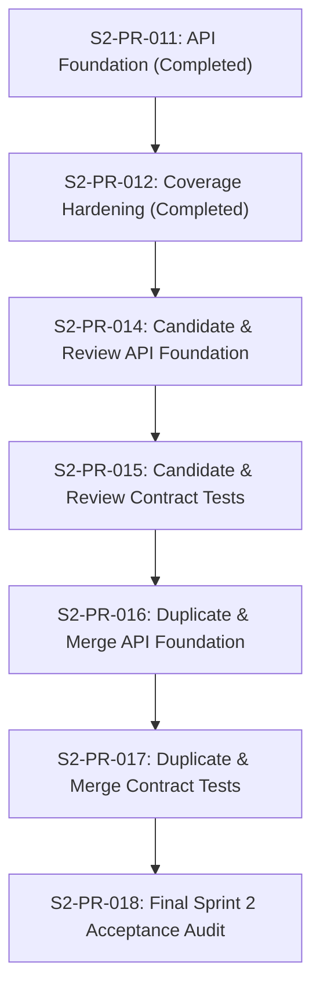

# Candidate / Review API Implementation Plan (Sprint 2)

This document maps out the next implementation sequence for the Candidate, Review Queue, Duplicate Detection, and Merge Decision APIs.

---

## 1. Current Completed Sprint 2 State
- Core Taxonomy schemas, logic, validation hierarchy, and RBAC rules are fully implemented and verified.
- Layer 1 Asset Identity API (`CanonicalAsset`, `AssetVariant`, `AssetAlias`) is complete, permission-protected, audited, and hardened.
- DB persistence layers for all Sprint 2 tables (including candidates, scores, duplicates, merge decisions, and review items) are fully migrated and active in SQLite/PostgreSQL schemas.

---

## 2. Existing Persistence Structures Available
The following models from previous PRs are ready to be integrated into the next API routers:
- `IdentityCandidate`: Holds candidate proposals referencing taxonomy nodes, canonical assets, or variants.
- `SimilarityScore`: Details match confidence scores and rule markers.
- `DuplicateCandidate`: Holds candidate pairs suspected of representing the same physical item.
- `MergeDecision`: Log of decisions to combine canonical assets or variants.
- `IdentityReviewItem`: Individual items mapped to manual validation queues.
- `IdentityDecisionLog`: Historical ledger of user decisions.

---

## 3. Proposed Next PR Sequence

To minimize code pollution and isolate concerns, we propose the following route sequence:

### PR Sequence Map

1. **S2-PR-014: Candidate + Review API Foundation**
   - Add routes and Pydantic schemas for `IdentityCandidate`, `SimilarityScore`, and `IdentityReviewItem`.
   - Setup RBAC and Audit trail hooks.
2. **S2-PR-015: Candidate + Review API Contract Tests**
   - Hardening unit tests verifying queue operations, state updates, and deny-by-default behavior.
3. **S2-PR-016: Duplicate/Merge Decision API Foundation**
   - Add routes and Pydantic schemas for `DuplicateCandidate`, `MergeDecision`, and `IdentityDecisionLog`.
4. **S2-PR-017: Duplicate/Merge Decision Contract Tests**
   - Hardening unit tests verifying merge configurations, status restrictions, and lock behaviors.
5. **S2-PR-018: Sprint 2 Final Acceptance Audit**
   - Overall schema verification, performance review, and cross-reference check.

---

## 4. Endpoints Proposed for Candidate + Review API
Prefix: `/api/v1/asset-identity`

### Candidate Routes
- `GET /candidates` (List proposals)
- `GET /candidates/{candidate_id}` (Get details)
- `PATCH /candidates/{candidate_id}` (Update status e.g. dismiss proposal)

### Review Queue Routes
- `GET /review-items` (List items in human queue)
- `GET /review-items/{review_item_id}` (Get queue item details)
- `PATCH /review-items/{review_item_id}` (Assign operator, update notes/metadata)
- `POST /review-items/{review_item_id}/resolve` (Submit review choice)

---

## 5. Endpoints Proposed for Duplicate/Merge Decision API
Prefix: `/api/v1/asset-identity`

### Duplicate Candidate Routes
- `GET /duplicates` (List suspected duplicate asset pairs)
- `GET /duplicates/{duplicate_id}` (Get duplicate metadata details)
- `PATCH /duplicates/{duplicate_id}` (Update duplicate status e.g. dismissed / pending_merge)

### Merge Decision Routes
- `POST /merge-decisions` (Create a proposed merge decision)
- `GET /merge-decisions` (List historical/pending merge decisions)
- `GET /merge-decisions/{decision_id}` (Get merge details)

---

## 6. Explicitly Deferred Behavior
The following behaviors are strictly **out of scope** for the next API building phases and must be deferred to Sprint 3 or specialized workers:
- **Automatic Candidate Generation**: No background scanners running parsing algorithms. All candidates are read/updated as static proposals.
- **AI/Embedding Scoring**: No calls to LLMs or vector databases for matching.
- **Worker Queues**: No Celery/Redis task distribution configurations.
- **Automatic Approvals**: No system-triggered approvals of master data. All transitions require explicit human interaction.
- **ProjectAssetLine Approved Identity Mutation**: No write-operations to project asset line status fields during candidate creation.
- **Merge Execution**: Creating a `MergeDecision` records the intent only; it does *not* execute the database script to rewrite historical references, aliases, or variant linkages.

---

## 7. RBAC Permissions to Apply
- `asset_identity:candidate:read` (List/get candidates and scores)
- `asset_identity:candidate:update` (Update candidate status)
- `asset_identity:review:read` (List/get review items)
- `asset_identity:review:update` (Assign review items, update notes, resolve item status)
- `asset_identity:duplicate:read` (List/get duplicates)
- `asset_identity:duplicate:update` (Update duplicate candidate status)
- `asset_identity:merge:create` (Create merge decision record)
- `asset_identity:merge:read` (View merge records)

---

## 8. Audit Events to Log
Every state modification must log an event to `AuditEvent`:
- `IDENTITY_CANDIDATE_UPDATE` (Payload contains updated status)
- `IDENTITY_REVIEW_ITEM_UPDATE` (Payload contains assignee or notes updates)
- `IDENTITY_REVIEW_ITEM_RESOLVE` (Payload contains outcome)
- `DUPLICATE_CANDIDATE_UPDATE` (Payload contains status changes)
- `MERGE_DECISION_CREATE` (Payload contains source asset ID and target asset ID)

---

## 9. Contract Tests Required
Each API endpoint group must have unit test assertions verifying:
- Deny-by-default for unauthorized credentials (returns 403 Forbidden).
- Read-only restrictions for viewer roles (returns 403 on POST/PATCH/DELETE).
- Valid enum transition validations (e.g. attempting to resolve review item without correct outcome code returns 422).
- Audit event generation on database logs.

---

## 10. Known Risks and Ambiguity
- **Execution vs Proposal boundary**: The boundary between writing a `MergeDecision` and the actual *execution* of merge operations (modifying primary/foreign keys on variant lines) must be strictly maintained to prevent silent cascade failures. S2-PR-016 must treat merges as proposal records only.
- **Row-version concurrency**: If multiple operators review the same candidate, optimistic locking via `row_version` must be active to reject stale writes.
