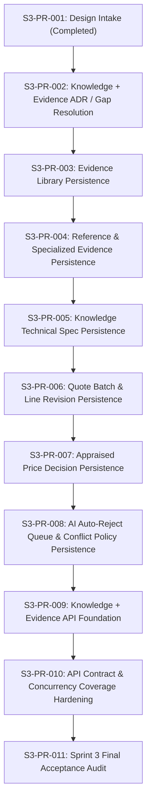

# Sprint 3 PR Breakdown — Knowledge + Evidence

This document outlines the proposed Pull Request sequence for implementing Sprint 3.

---

## PR Sequence Map

### S3-PR-002: Knowledge + Evidence ADR / Gap Resolution
- **Goal**: Write and commit the necessary architecture decisions (ADR 0018 on registry strategy and ADR 0019 on quote conflict calculation).
- **Scope**: Documentation changes only.

### S3-PR-003: Evidence Library Persistence
- **Goal**: Implement `evidence_sources`, `evidence_files`, `evidence_links`, and `evidence_access_logs` models and migrations.
- **Scope**: Backend models, Alembic migrations, database unit tests.

### S3-PR-004: Reference & Specialized Evidence Persistence
- **Goal**: Implement specialized evidence models (supplier quotes, catalogue info, internet extracts, images, emails, extraction results, and review decisions).
- **Scope**: Models and migrations for specialized evidence and parsing.

### S3-PR-005: Knowledge Technical Spec Persistence
- **Goal**: Implement `technical_specifications`, `technical_specification_versions`, and `knowledge_versions` models.
- **Scope**: Core catalog metadata models and migrations.

### S3-PR-006: Quote Batch & Line Revision Persistence
- **Goal**: Implement `quote_batches` and `quote_lines` with revision increments and relationship fields.
- **Scope**: Vendor pricing baseline persistence.

### S3-PR-007: Appraised Price Decision Persistence
- **Goal**: Implement `appraised_price_decisions` and extend project lines mapping columns.
- **Scope**: Finalized price standards mapping.

### S3-PR-008: AI Auto-Reject Queue & Conflict Policy Persistence
- **Goal**: Implement `knowledge_queue_items`, `knowledge_conflicts`, and `knowledge_confidence` metadata triggers.
- **Scope**: Verification queue persistence.

### S3-PR-009: Knowledge + Evidence API Foundation
- **Goal**: Implement the core controllers and routers under `/api/v1/knowledge` and `/api/v1/evidence` prefixes, including RBAC scopes and audit logging hooks.
- **Scope**: Routers, controllers, schemas.

### S3-PR-010: API Contract & Concurrency Coverage Hardening
- **Goal**: Complete contract testing suite (verifying soft-unlinking, sensitive log triggers, auto-rejection triggers, and price spread validations).
- **Scope**: Backend testing suites.

### S3-PR-011: Sprint 3 Final Acceptance Audit
- **Goal**: Complete the Sprint 3 final audit checking all constraints and coverage.
- **Scope**: Final audit report document.
